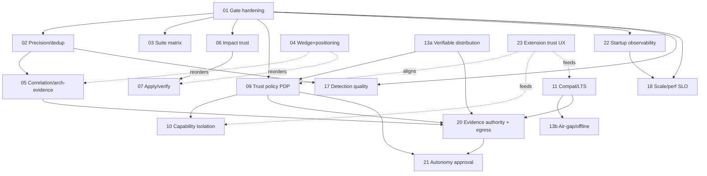

# OpenSIP CLI — Master Plan & Platform Roadmap

> **Status:** Draft consensus (engineering + analysis). Product ratification pending.
> **Scope:** `opensip-cli` (this repo) + its platform fit with the sibling `opensip` (Cloud) repo.
> **Home:** `docs/plans/` is **gitignored / local-only** — this is in-progress strategy, not a published doc. Durable decisions graduate to `docs/decisions/` (ADRs); reader-facing facts to `docs/public/`.
> **Provenance:** Distilled from a four-agent, 17-turn review recorded in
> [`docs/internal/coop/agents-log.md`](../internal/coop/agents-log.md). That log is the *deliberation record* (chronological, with superseded positions); **this** document is the *authoritative output*. Where they differ, this document wins.
> **Last updated:** 2026-06-30.
> **Decision log (2026-06-29):** ADR-0095 ratified the CLI positioning posture ("AI-native guardrail platform, **not an AI runtime**") and the `what-is`/`03-vs`/`faq`/`system-context` docs were reconciled to match. ADR-0094 committed as the governing decision behind §1.3 + spec 20. Product decision **§1.5.2 resolved**: keep the **autonomous loop front-and-center as vision/direction** (access hard-gated — no GA), with the **evidence-authority plane (spec 20) as the durable technical moat**. Spec 21 reframed: it gates *opening access*, not *headlining*.

---

## 0. How to read this

- **Part I** — product & platform strategy (the *why*).
- **Part II** — the specification backlog (the *what*): existing specs 01–08 audited + new specs 09–23.
- **Part III** — roadmap, critical path, and the dependency-ordered build sequence (the *when*).
- **Part IV–V** — risks, and cross-cutting requirements every spec must satisfy.
- **Part VI** — methodology, confidence levels, and what to verify before locking.

**What is decided vs. open.** Everything in Parts II–V is engineering/architecture
consensus across all four reviewers. One **product** decision remains open — spec-04
wedge ratification. The autonomous-loop direction is decided, but access remains
hard-gated by spec 21. Do not let this plan's coherence substitute for the remaining
product decision.

---

# Part I — Product & Platform Strategy

## 1.1 What opensip-cli is (and deliberately is not)

opensip-cli is a **local-first, deterministic, polyglot code-intelligence CLI** that hosts pluggable analysis tools (`fit`, `graph`, `sim`, `yagni`) on a shared Tool contract, with host-owned planes for output, baseline/ratchet, sessions, and suites.

The shipped public positioning (`docs/public/00-start/03-vs-other-tools.md`, v0.1.15) makes two **anti-claims** that the strategy below honors:

- **Not a security scanner** — "Snyk / Dependabot / GitHub Advanced Security are the right call for CVE-scale work."
- **Not an AI runtime** — "No model calls, no embeddings, no autonomous code
  changes. The CLI emits deterministic evidence that AI agents can consume
  through JSON, sessions, `agent-catalog`, and MCP."

**These anti-claims are load-bearing.** Agent-friendly is not the same as
agentic: MCP, `agent-catalog`, agent recipes, structured JSON, and session replay
are deliberate read surfaces for external agents, not evidence that opensip-cli
is itself an AI product. An earlier internal consensus drifted toward a
"security-scanner beachhead → autonomous AI product" wedge — i.e., the exact two
lanes the product's own docs disclaim, and the two most incumbent-owned lanes in
the market. The competitive red-team (agents-log Turn 8) caught and reversed
this. The corrected strategy follows. **Ratified in [ADR-0095](../decisions/ADR-0095-ai-native-guardrail-platform-posture.md)** (2026-06-29): the anti-claims are now a durable decision, and the `what-is`/`03-vs`/`faq`/`system-context` docs were reconciled to "not an AI runtime" in the same pass.

## 1.2 The wedge (CLI layer) — *decided*

**One-liner:** *Deterministic, local **architecture evidence** for CI and coding agents.*

| Dimension | Position | Rationale |
|-----------|----------|-----------|
| **Moat (retention)** | Graph-backed, cross-tool **architecture-evidence plane** — project rules as code + call-graph context + baseline/ratchet + suite/session provenance + MCP-readable output | The only differentiated cells in opensip-cli's own competitive matrix (architectural rules as code, static call-graph rules, `sim`, `.mjs` plugins, offline+free) — none are "security" or "AI." **Spec 05 is the engineering centerpiece (re-weighted Medium → High).** |
| **Acquisition (first install)** | Security **orchestration** — "one ratcheted local gate over gitleaks/trivy/osv **plus** your architecture rules," SARIF into Code Scanning | Keeps the external proof-oracle (GitHub Code Scanning renders net-new-alert diffs) **without** claiming to be a scanner. Resolves the docs contradiction: you are the *gate/correlation plane above* scanners, not a scanner. |
| **Agents** | External agents **consume** deterministic evidence (`agent-catalog`, MCP, JSON, sessions) — *agent-friendly, not agentic* | Agents need machine-readable, ratcheted ground truth. The CLI should be easy for agents to drive, but it does not call models, embed code, or autonomously mutate repos. Spec **07** (repair apply/verify) is a later safety layer, **not** the headline. |
| **Buyer** | Platform / staff-architecture team (champion); eng-director/security shared budget (economic); CI + agents (daily users) | The architecture-evidence moat is bought by people who own project-specific constraints and CI policy — **not** AppSec, which is the worst-fit persona for current capability (see R-1). |

**Mandatory (positioning half — done 2026-06-29):** the `03-vs-other-tools.md` reconciliation is complete. ADR-0095 ratified keeping the anti-claims, and the docs (`what-is`/`03-vs`/`faq`/`system-context`) were updated to "not an AI runtime." Spec 04's remaining open scope is the **wedge half only** (architecture-evidence moat vs. security-orchestration acquisition + competitive inputs) — not the positioning fork.

## 1.3 The platform (CLI + Cloud) — *premise corrected; one fork open*

Round 3 examined the pair: `opensip-cli` (local) + `opensip` Cloud (server-side, in the sibling repo). The key finding **inverted the working assumption**:

> The assumption was *"Cloud is a flat signal store with no home for the CLI's graph/baselines/sessions → the moat dies for lack of Cloud memory."*
> The evidence (parent-repo schema + DEC-520/537/546/589) is the **opposite**: Cloud **independently re-computes** the CLI's core competency — it clones repos server-side and builds its **own** code-graph (`tenant.code_symbols`/`code_edges`/`fileCatalog`), its own run history and assessment scoring, and an **autonomous fix-and-merge pipeline**.

So the platform risk is **not** missing storage — it is **moat cannibalization + dual-source-of-truth divergence**, compounded by a **lossy egress**: the shipped SARIF handoff (`signal-sarif.ts:127`) *intentionally drops* `Signal.metadata`, `fingerprint`, and `repair`. The CLI's rich, deterministic evidence is *discarded at the wire* **and** *redundantly recomputed* by a server engine that can disagree with it. The marketed moat ("deterministic local evidence → Cloud organizational memory") currently ships as its opposite.

**Resolution — hybrid evidence authority (one identity model, three authority tiers):**

1. **Cloud-derived** — server recomputes from its own clone; authoritative for SaaS integrity/freshness (today's reality, kept).
2. **CLI-attested** — Cloud accepts CLI evidence *only* when the run carries signed provenance (CLI version/distribution identity, repo commit, declared-input manifest, config/policy ids, capability-pack provenance, artifact digests). This is the "deterministic local evidence as ground truth" path; its admission cost is paid by specs **09** (provenance/trust) + **13a** (signing).
3. **External / untrusted** — third-party SARIF: stored and correlated, but **never overrides** authoritative state.

**Invariant:** Cloud may recompute, but it must **correlate with CLI evidence and report divergence** — never silently mint a second truth. Divergence records carry a **severity** keyed to whether CLI and Cloud would reach a *different gate/ticket outcome*; sub-verdict divergence is suppressed (else "report divergence" is constant noise across two engines). This is **spec 20**.

## 1.4 Division of labor & the open-core line

A single rule answers both "what belongs in Cloud" and "what is paid":

> **An artifact or capability belongs in Cloud iff it requires more than one repo, more than one run, or more than one actor.**

This maps the *technical* boundary onto the *monetization* boundary, and matches the shipped billing seam (DEC-589: ingest is RBAC-only/free; billing gates **downstream at process dispatch**).

| Layer | Belongs to | Open-core | Examples |
|-------|-----------|-----------|----------|
| Single-repo, single-run, offline, deterministic | **CLI** | **OSS, free** | gates, graph build, baselines (local), sessions (local), suite, MCP read, SARIF export, adapter orchestration |
| Signal egress + storage + basic dashboards | Cloud **store tier** | Free / cheap | `--report-to`, signal ingest (DEC-587/588) |
| Cross-repo / longitudinal / multi-actor + autonomous processing | Cloud **process tier** | **Paid** | reconciler→tickets, cross-repo correlation, org-policy serving, trends, autonomous fix/PR/merge, team workflow |

**Mandatory spec field:** every enterprise/platform spec must declare its **open-core placement** (OSS-CLI / Cloud / both) + its embedded-vs-SaaS persistence story. Without it, specs 09/15/20 risk being built CLI-local with no SaaS path, violating the standing "works in both embedded and SaaS modes" constraint.

## 1.5 Product decisions and access gates

1. **Spec-04 wedge ratification.** *Positioning/anti-claim fork **resolved** (ADR-0095 + doc reconciliation, 2026-06-29).* Still open: the **wedge** — ratify the §1.2 hypothesis (architecture-evidence moat + security-orchestration acquisition) with owner + deadline + competitive inputs. Gates the sequencing of 05/07.
2. **Is autonomous-merge the platform moat? — DECIDED 2026-06-29 (product/founder).** Both/and, not either/or: the **autonomous loop is the directional headline/vision**, kept front-and-center in marketing (the market conversation is moving to autonomous loops; it is authentic to the OpenSIP origin), while the **evidence-authority plane (spec 20) is the durable *technical* moat** it is built on. **Critical guardrail: access is hard-gated** — the autonomous loop runs today but is in controlled testing with *zero* external users and no general availability. That keeps the headline a *vision/direction* claim, not a *sellable-now* claim, satisfying §1.6's honest-conditional-headline rule. **Consequence:** spec 21 gates *opening access* to the autonomous loop (admitting the first company), **not** *headlining* it.

## 1.6 Honest, conditional headlines

- **CLI headline** (*local graph-backed architecture evidence for CI + agents; optional Cloud sync*) — **true today.** Ship it.
- **Platform "one evidence plane"** — **false until spec 20 closes.** Do not market it yet. *(Unchanged by the §1.5.2 decision — this is a separate CLI↔Cloud correctness/honesty item.)*
- **"Autonomous loop / merge"** — **fine to headline as vision/direction** *because access is hard-gated* (no GA; controlled testing only). It is **not enterprise-*sellable* until spec 21** lands (auditable approval / change-control), so spec 21 is the precondition for **opening access**, not for the homepage. The site must signal status ("early access," never "available now").

---

# Part II — Specification Backlog

> **Spec layout (2026-06-30):** CLI-anchored specs live flat in `docs/plans/specs/`.
> The one Cloud-owned spec (**21**) was relocated to the **`opensip` platform repo**
> (`docs/plans/specs/` there). The cross-repo contracts **09** and **20** stay in
> this repo because the spec's CLI side lives here while the Cloud half is tracked
> parent-side as a `DEC-NNN`. Each spec's `## Status` carries an implementation-state
> line (already-shipped substrate vs. unbuilt work).

## 2.1 Existing specs (01–08) — audit verdicts & required amendments

All eight were audited against code + 91 ADRs + `docs/internal/*`. Verdict: **approve with amendments**; none rewritten.

| # | Spec | Verdict | Key amendment(s) |
|---|------|---------|------------------|
| **01** | Hidden-state gate hardening | **Critical — build first** | Declared-inputs manifest schema; `cli.sessions.keep` + datastore retention/vacuum; cold no-cache CI lane; **≥1 non-TS design-partner repo** in that lane (counters R-1); fix dangling ADR→plan pointers (ADR-0061/0008 + `consumers/opensip.md`); name *all* mutable gate inputs (baselines, graph catalogs, advisory-DB mode, env passthrough, lockfile/PM identity). Dependencies are **not** "None" — depends on config schema (ADR-0023), datastore, CI infra. |
| **02** | Precision & dedup hardening | Approve | Dedup runs on the **host output plane** (ADR-0011), not per-tool; extend to graph rules; disposition taxonomy (false-positive / accepted-risk / design-mismatch) — heatmaps are *signals*, not proof. |
| **03** | Suite-plane correctness | **Approve, reframed** | The worst-of aggregation bug is **already fixed** (`orchestrator.ts`, verified AV1). Primary work is now **matrix tests + expanded machine output** — `SuiteStepSummary` is summary-only; must carry per-step verdict + counts (CI datastore is ephemeral, so link-only is worthless). Delete dead `ready/05` ref → ADR-0093. |
| **04** | Product **wedge & positioning** decision | Approve (decision memo) | Rename to **Wedge *and Positioning* Decision**; add owner/deadline/RACI; mandatory competitive inputs + `03-vs` reconciliation; buyer split; the §1.2 wedge as the recommended hypothesis. Runs **parallel** with 01–02, not after. |
| **05** | Correlation v0 / architecture-evidence join | **Approve, re-weighted Medium → High** | This is the **moat centerpiece**, not a post-precision nicety. Scope to *evidence/entity correlation over graph + tool signals* (graph blast-radius, identity tiers), **not** a composite risk score. Define **identity stability tiers** (same-run / same-commit / changed-file / moved-renamed / cross-version / **CLI↔Cloud divergence**). |
| **06** | Impact-analysis trust foundation | Approve | Absorbs **caching-soundness / graph-freshness** (a stale cache ≡ stale graph for trust); add git edge cases (shallow clone, merge commits); explicit **non-goals**: no perf SLOs/large-repo benchmarks (those are spec 18). |
| **07** | Agent apply/verify loop | **Approve, deferred** | Open with "**not shipped**"; re-anchor MCP dep to ADR-0084 (not the gone `ready/02-mcp-server/`); transactional apply semantics (preflight dirty-worktree, preview, conflict-safe, rollback, interruption-survivable record). **Not the wedge headline.** |
| **08** | Sandboxed extension marketplace R&D | **Approve as dormant** | Re-anchor to **ADR-0087** as an *unshelving criteria / R&D trigger*, not active backlog. Add a "curated trusted registry" middle path. Does **not** cover in-process capability packs (that's spec 10). |

## 2.2 New specs (09–23)

| ID | Title | Priority | Tier | Why it exists / depends on |
|----|-------|----------|------|----------------------------|
| **09** | Enterprise **trust policy plane** (PDP kernel + PEP phases) | **Critical** | Floor | Re-homes ADR-0061's three-gate work (now orphaned). A single **Policy Decision Point** (schema + evaluation + audit-event emission) with thin **Policy Enforcement Point** *phases*: provenance enforcement, org-config hierarchy, audit/compliance export, gate-config governance. **Platform-shared** model (CLI *and* Cloud — both are greenfield on org policy). Deps: ADR-0023/0061/0068/0081, **13a**, and compatibility with **23**'s near-term trust UX. |
| **10** | Capability **resource isolation** + `requires` enforcement | High | Floor | Admission/trust UX is handled by ADR-0081 + spec 23; the remaining gap is that non-bundled capability packs still **import in-process at full host authority** (`capability-discovery.ts`). Strongest TCB-growth surface; outside spec 08's broker scope. Deps: 09, 23, ADR-0081. |
| **11** | Platform compatibility / LTS / migration (+ machine-output compat window) | High | Floor↔GTM | Enterprise upgrade contracts: stable CLI/config/JSON/plugin surfaces, deprecation windows, migration commands, compat tests. Folds the **agent-facing JSON semver/deprecation window** (governed today by ADR-0050/0065). Deps: ADR-0023/0074. Gates 13/20. |
| **13a** | **Verifiable self-distribution** (checksums, SBOM, signing) | High | Floor | Precondition for 09's provenance PEP — you cannot enforce *extension* provenance while your *own* distribution is unverifiable. The published GitHub Action already ships (`action.yml`) — 13a *specs* it (versioning, hashes, non-cloud variant). |
| **13b** | Air-gap / mirrors / containers / rollback | Medium | GTM | Regulated/air-gapped deployment. Buyer-gated. Deps: 13a, 11. |
| **17** | Detection-quality measurement (labeled **multi-language** corpus) | High | Product quality | SAST buyers demand measured FP/FN rates; spec 02 is reactive (waiver heatmap), the fixture harness is per-check. Add an **architecture-triage usefulness** metric (does graph context change a merge decision?). The corpus must be **multi-language** (counters R-1). Deps: 01, 02. |
| **18** | Scale & performance SLOs (large-repo budgets) | High/Med (wedge-dep) | Product quality | CI wall-clock/memory are product features; the 264 MB datastore bug was a symptom. Primitives exist (ADR-0015/0028/0032) but no SLO/benchmark. **Same measurement harness as 17.** Deps: 01, 06. |
| **20** | **Platform evidence authority & egress contract** | **Critical** | Platform floor | **Governing decision: ADR-0094** (committed 2026-06-29). Resolves the CLI↔Cloud dual-source-of-truth: hybrid authority tiers (§1.3), full-fidelity signed egress, **divergence-severity model**, SARIF `partialFingerprints`/`properties` round-trip. Deps: **05, 09, 11, 13a, 01-manifest**. *Not* a CLI-only blocker. |
| **21** | Enterprise autonomy approval & change-control | **Access-gated** | GTM | Cloud-owned spec in the sibling `opensip` repo. Auditable human/team approval, separation of duties, kill switch, rollback, branch-protection integration, compliance export — the surface Cloud's autonomous pipeline lacks. **Precondition for opening autonomous-loop access** to the first external company (§1.5.2, decided 2026-06-29): headlining-as-vision does not require it; *admitting a user* does. Deps: 09, 20. |
| **22** | Startup observability & load diagnostics | High | Operability floor | v0.1.15/v0.1.16 dogfood exposed attribution gaps: degraded fit-pack warnings can collapse to `Optional check pack "unknown" failed to load` or quote the raw cause in the wrong slot, and pre-banner startup pauses are not broken down by phase. Preserve structured capability-load diagnostics and add startup/pre-action/time-to-first-render timing. Deps: 01, 10, 18, ADR-0052/0054/0060/0081/0084. |
| **23** | Low-friction customer extension trust | High | Extension UX floor | v0.1.16 prep exposed that secure deny-by-default trust gates make the intentional customer path feel broken: configured packs and installed/authored tools require hidden env-var allowlists. Target: explicit config/install/create actions are trust decisions; ambient discovery remains denied. Aligns with 09, 10, 11, ADR-0023/0054/0060/0074/0081. |

**Proposed, not yet consensus:**

| ID | Title | Status |
|----|-------|--------|
| **19** | Human triage & report surface (`@opensip-cli/dashboard` sharing/retention/diff/annotations) | Medium, GTM — proposed (B Turn 10), not ratified |

## 2.3 Items absorbed / folded (not standalone specs)

The "18-item" backlog spans IDs 01–18 but several mid-numbers were **absorbed** during review — the literal standalone count is lower:

| Original proposal | Disposition |
|-------------------|-------------|
| 12 — enterprise org-config plane | → **scope phase inside spec 09** (PEP) |
| 14 — MCP lifecycle | → **folded into spec 07** / future MCP write surface |
| 15 — audit-trail & compliance export | → **scope phase inside spec 09** (PEP) |
| 16 — unified support bundle | → **Low / deferred** (ops convenience) |
| (provenance enforcement, gate-config governance) | → **PEP phases inside spec 09** |

---

# Part III — Roadmap & Sequencing

## 3.1 Floor vs GTM partition

- **Trust/security FLOOR — build regardless of demand** (not building it ships fault-isolation-as-security, a liability per ADR-0061): **01, 09, 10, 13a, 20.** Plus correctness/moat: **02, 03, 05, 06.** Operability/extension UX floor: **22, 23**.
- **GTM features — demand-gate behind a named design partner: 13b, 16, 19, 21**, and 09's audit/compliance PEP phases.

## 3.2 Critical path (the spine)

```
01 ─→ 09 (+13a) ─→ 05 ─→ 20          platform-evidence spine
  └─→ 06 ─→ 07                        agent-loop spine
  └─→ 02, 03 (parallel after 01)
  └─→ 23 ──aligns with── 09/10/11      customer extension trust UX
04 (positioning decision)  ‖ Phase 0–1
17 + 18 + 22 (measurement/operability) ‖ throughout
```

## 3.3 Phased build sequence

### Phase 0 — Unblock the gate *(precondition for everything)*
- **01** first sprint: record baseline (`pnpm lint && pnpm fit:ci` green on a clean checkout); cold no-cache CI lane (clean install, empty `.runtime`, no eslint/prettier/turbo caches); declared-inputs manifest; `cli.sessions.keep` + datastore retention/vacuum; **≥1 non-TS design-partner repo** in the cold lane; fix dangling ADR→plan pointers.
- **04** wedge & positioning memo *(parallel, weeks 1–2)*: competitive inputs, `03-vs` reconciliation, buyer split.

*Rationale:* every gate, suite, baseline, correlation, and "verified repair" is only trustworthy under deterministic gates. Blocks 02/03/06/07.

### Phase 1 — Correctness + trust floor *(after 01 green; run in parallel)*
- **02** precision/dedup → unblocks 05
- **03** suite matrix + expanded self-describing output
- **06** impact-analysis trust (+ caching-soundness) → unblocks 07
- **09** trust-policy **PDP kernel** → unblocks 10; shared platform policy model
- **13a** verifiable self-distribution → precondition for 09's provenance PEP
- **10** capability resource isolation + `requires` enforcement *(after 09 kernel)*
- **22** startup observability + load diagnostics *(can land in slices; feeds 18 perf attribution)*
- **23** low-friction customer extension trust *(capability-pack slice can land for
  v0.1.16; full tool workflow after spec review)*

### Phase 2 — Moat engineering *(after 02 + 06)*
- **05** correlation v0 / architecture-evidence join *(the differentiator)* — after 02 + identity tiers
- **11** platform compat / LTS / migration → gates 13b, 20
- **17** detection-quality measurement *(parallel)* — feeds 02
- **18** scale & perf SLOs *(parallel — same harness as 17)*

### Phase 3 — Platform layer *(after 05 + 09 + 11 + 13a)*
- **Cheap egress win** (`fingerprint → SARIF partialFingerprints` + curated `properties`) — immediate benefit to GitHub Code Scanning; paired CLI+Cloud change for Cloud fidelity (parent `sarif-transform.ts` must consume it).
- **20** platform evidence authority & egress contract *(Critical)*
- **07** agent apply/verify loop *(wedge-dependent; only if agent wedge)*

### Phase 4 — GTM / demand-gated *(behind a named design partner)*
- **13b** air-gap/mirrors/containers/rollback
- **09** audit-trail + compliance-export PEP phases
- **21** enterprise autonomy approval *(precondition for **opening autonomous-loop access** — §1.5.2 decided 2026-06-29; must land before the first external user is admitted, not before headlining)*
- **19** human triage & report surface *(if it reaches consensus)*
- **16** support bundle *(low / ops)*

### Dormant
- **08** marketplace sandbox R&D — only if the wedge selects a public marketplace (ADR-0087 unshelving trigger).

## 3.4 Dependency graph



---

# Part IV — Risks & Architectural Concerns

| # | Risk | Mitigation |
|---|------|------------|
| **R-1** | **Dogfood monoculture bias** — every spec's evidence is self-analysis of a TypeScript Turborepo. Check-depth is **TS 235 / universal 286 vs 1 each for Go/Java/Rust/C++** (verified). Roadmap is blind to polyglot/large-repo/non-monorepo enterprise reality, and the README's "150+ checks across 6 languages" over-promises. | Multi-language labeled corpus (17); ≥1 non-TS repo in 01's cold lane; scope the README claim honestly. |
| **R-2** | **False verification is the catastrophic failure mode** — 07 before 01+06 produces confident wrong "verified." | Hard-sequence 07 behind 01+06; conservative fallback when impact uncertain. |
| **R-3** | **Dual-source-of-truth divergence** (CLI vs Cloud graph) + **lossy SARIF egress** — the marketed "one evidence plane" ships as two engines on a lossy wire. | Spec 20 (hybrid authority + divergence-severity + full-fidelity egress). |
| **R-4** | **Autonomous-merge liability** — Cloud merges PRs with policy/AI gates but no auditable enterprise change-control surface. | Access hard-gated (no GA) until **spec 21** lands — spec 21 is the precondition for *opening access*, not for headlining-as-vision (§1.5.2, decided 2026-06-29); the evidence plane (spec 20) remains the durable technical moat. |
| **R-5** | **Enterprise gold-plating ahead of PMF** — loading a v0.1.x OSS CLI with governance specs before a design partner. | Floor-vs-GTM partition (§3.1); demand-gate GTM specs. |
| **R-6** | **Spec/doc/ADR drift** — `docs/plans` is gitignored, so ADRs outlive their implementing specs (ADR-0061/0008 cite vaporized `arch-improvements/01-03`, `ready/`, `consumers/opensip.md`). | ADR-hygiene rule: "Implemented by" must point to a committed artifact or a shipped-code path. Fix in 01's first sprint. |
| **R-7** | **Policy fragmentation** — provenance, allowlists, org config, audit, egress built separately → inconsistent enterprise behavior. | Single PDP/PEP plane (spec 09) owns strict/default mode + exceptions. |
| **R-8** | **Over-specification** — eight internal improvement processes already exist; new specs must cite why promotion isn't enough. | G0–G3 triage; reconcile against ADRs/`docs/internal/*` before declaring anything missing. |
| **R-9** | **Invisible degraded startup** — pre-banner pauses and load warnings without package identity create false rebuild/update theories and make dogfood failures hard to root-cause. | Spec 22: structured load diagnostics + startup/pre-action/time-to-first-render timing in logs, JSON, and sessions. |

---

# Part V — Cross-cutting requirements (every spec must satisfy)

1. **Open-core placement field** — OSS-CLI / Cloud / both + embedded-vs-SaaS persistence story (§1.4).
2. **Measurable success** — an SLO/metric target, not only qualitative acceptance criteria (e.g. spec 02 needs an FP-rate target; spec 18 a time/memory budget).
3. **Rollback / migration note** — how the change is reverted or migrated (esp. datastore/schema/wire-contract changes).
4. **Reconciliation-first** — cite why promotion of existing ADRs/processes is insufficient before claiming a capability is "missing."
5. **Self-describing machine output** — anything an agent or CI artifact consumes must be complete offline (the CI datastore is ephemeral).

---

# Part VI — Methodology, confidence & verification debt

**How this was produced.** Four independent reviewers (A/B/C/D), 17 turns, three rounds: (1) spec audit + enterprise gap analysis, (2) competitive red-team that reversed the wedge, (3) CLI↔Cloud platform-fit that inverted the storage premise. Each load-bearing claim was verified against code/ADRs/parent-repo before adoption; several initial claims (including the reviewers' own) were caught as stale and withdrawn. Full record: [`agents-log.md`](../internal/coop/agents-log.md).

**Confidence levels.**
- **High (read in code):** lossy SARIF egress (`signal-sarif.ts:127`); spec-03 bug fixed (`orchestrator.ts`); capability-pack admission landed (ADR-0081); check-depth asymmetry; `fit:ci` green today.
- **Medium-high (parent-repo, file-cited, not line-by-line re-read):** Cloud independently builds graph (DEC-520); autonomous pipeline (DEC-537); billing gates downstream (DEC-589); native `/v1/ingest` exists but not the full-fidelity `SignalBatch` contract.
- **Medium (market knowledge, Jan-2026 cutoff):** GHAS/Copilot-Autofix/Sonar/Semgrep positioning. **Verify current state before spec 04 finalizes.**

**Verification debt to clear before locking:**
1. Spot-check `parent/packages/db-schemas/.../code-intelligence/*` + DEC-520 (the premise-inversion is load-bearing).
2. Run `pnpm lint && pnpm fit:ci` on a clean checkout, record result (spec 01 item 1).
3. Confirm parent `sarif-transform.ts` ignores `properties`/`partialFingerprints` (gates the "cheap egress win" scope).
4. Re-verify GHAS/Copilot-Autofix/Sonar current state.

**Product decision still owed (§1.5):** spec-04 wedge ratification. The
autonomous-loop direction was resolved on 2026-06-29; spec 21 now gates opening
external access.

---

## Appendix — Evidence index

**Key ADRs (this repo):** 0008 (Cloud signal sink / open-core), 0011 (output plane), 0023 (config schema), 0036 (baseline/ratchet plane), 0050/0065 (public JSON contract), 0061 (extension trust tiers / three gates), 0068 (consumption-side verification), 0074 (plugin epochs), 0081 (capability-pack admission), 0084 (MCP read), 0086 (signal.repair), 0087 (public-ecosystem shelved), 0093 (suite plane), 0094 (CLI↔Cloud evidence authority + egress fidelity — governs §1.3 / spec 20), 0095 (AI-native guardrail platform posture, "not an AI runtime" — ratifies §1.1).

**Key parent (Cloud) decisions:** DEC-520 (multi-repo materialization), DEC-537 (orchestrator ticket transitions), DEC-546 (signals repo-scoping), DEC-554 (RLS tenant isolation), DEC-587 (CLI↔Cloud SARIF wire contract), DEC-588 (repo-less ingest), DEC-589 (ingest RBAC-only, billing downstream).

**Key files:** `packages/output/src/format/signal-sarif.ts:127` (lossy egress); `packages/output/src/sink/cloud-signal-sink.ts` (native SignalBatch); `packages/cli/src/commands/suite/orchestrator.ts` (suite aggregation, fixed); `capability-discovery.ts` (in-process pack import); `action.yml` + `docs/public/60-guides/cloud-handoff.md` (shipped Cloud handoff); `docs/public/00-start/03-vs-other-tools.md` (positioning).
