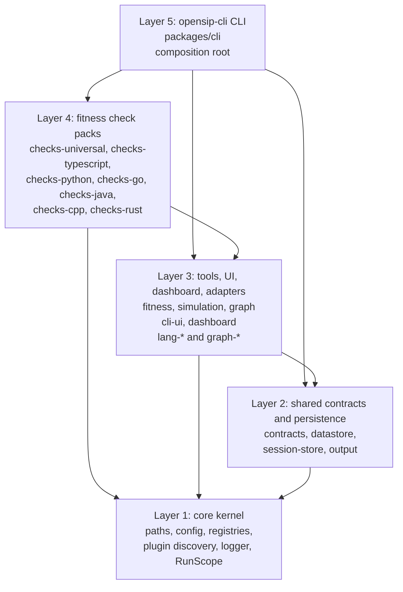
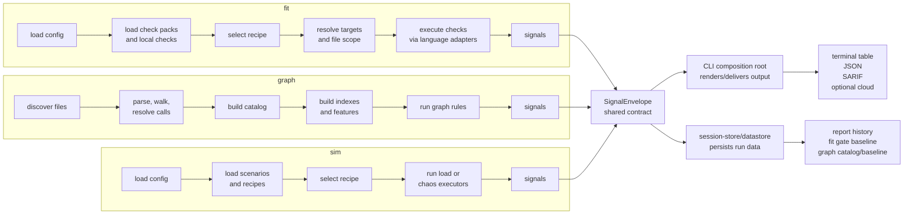

# Architecture overview

This is the map before the tour. You have already seen where opensip-cli sits relative to your project, CI, the dashboard browser, and optional OpenSIP Cloud; this page zooms one level inward to show how the packages connect and how a run flows through the system.

> **What you'll understand after this:**
> - The package layers and which way dependencies point.
> - How the CLI bootstraps tools, adapters, plugins, output, and persistence.
> - How `fit`, `graph`, and `sim` converge on the same `SignalEnvelope`.
> - Which packages own each major boundary.

---

## Package layers

Arrows mean "depends on". The dependency-cruiser rules enforce this shape so lower layers do not reach upward into tools or the CLI.



The important thing is the direction of knowledge. `packages/cli` knows everything because it composes the process. `@opensip-cli/core` knows almost nothing because every tool depends on it. Tool engines sit in the middle: they own domain execution, but they return shared contracts instead of importing the CLI.

---

## Runtime flow

Every invocation starts in the CLI composition root. The CLI builds fresh registries, registers first-party tools and adapters, discovers plugin packages, mounts commands, and then lets the selected tool own the domain work. All first-party tools converge on the same `SignalEnvelope`, which the CLI renders, persists, or sends onward.

```mermaid
flowchart TB
  user["Developer / CI"]
  browser["Dashboard browser"]
  cloud["OpenSIP Cloud<br/>optional"]

  target["Target project<br/>source code<br/>opensip-cli.config.yml<br/>opensip-cli/fit<br/>opensip-cli/sim"]
  runtime["Project runtime dir<br/>opensip-cli/.runtime<br/>datastore.sqlite<br/>logs/*.jsonl<br/>reports/latest.html<br/>plugins/*/node_modules"]

  cli["opensip-cli CLI<br/>packages/cli<br/>argv, commands, composition"]
  core["core services<br/>paths + config<br/>ToolRegistry + LanguageRegistry<br/>plugin discovery<br/>logger + RunScope"]
  tools{"ToolRegistry<br/>command dispatch"}

  lang["Fitness language adapters<br/>lang-typescript, lang-python,<br/>lang-rust, lang-go,<br/>lang-java, lang-cpp"]
  graphAdapters["Graph language adapters<br/>graph-typescript, graph-python,<br/>graph-rust, graph-go, graph-java"]
  checkPacks["Fit check packs<br/>first-party, marker-discovered,<br/>exact config, project-local"]
  scenarioPacks["Sim scenario packs<br/>project-local + npm packs"]

  fit["Fitness engine<br/>checks, recipes, gate"]
  sim["Simulation engine<br/>scenarios, recipes, executors"]
  graph["Graph engine<br/>catalog, indexes, features, rules"]

  envelope["SignalEnvelope<br/>@opensip-cli/contracts"]
  output["Output package<br/>table, JSON, SARIF<br/>cloud sink"]
  datastore["Datastore + session-store<br/>SQLite sessions<br/>fit baseline<br/>graph catalog + baseline"]
  dashboard["Report composition<br/>CLI + @opensip-cli/dashboard"]

  user -->|runs fit, sim, graph, report| cli
  cli -->|bootstrap per invocation| core
  core -->|reads| target
  core -->|resolves and creates| runtime
  cli -->|registers bundled adapters| lang
  cli -->|discovers/registers adapters| graphAdapters
  cli -->|mounts subcommands| tools

  tools --> fit
  tools --> sim
  tools --> graph

  fit -->|loads| checkPacks
  fit -->|filters/parses content through| lang
  sim -->|loads| scenarioPacks
  graph -->|builds catalog through| graphAdapters

  fit --> envelope
  sim --> envelope
  graph --> envelope

  envelope -->|format or deliver| output
  envelope -->|save run history| datastore
  fit -->|save/compare gate baseline| datastore
  graph -->|persist catalog and gate baseline| datastore

  output -->|stdout table / JSON / SARIF| user
  output -.->|report-to when configured| cloud

  cli -->|collects report data| dashboard
  dashboard -->|reads sessions and tool data| datastore
  dashboard -->|writes latest.html| runtime
  runtime -->|opens static report| browser
```

The local-first rule from system context still holds: there is no daemon, no queue, no server database, and no background worker. The only durable local state is under `<project>/opensip-cli/.runtime/`.

---

## Tool execution flow

The three built-in tools are different domains, but they intentionally return the same output currency.



This shared envelope is the architectural hinge. It lets the three tools keep their own execution models while sharing output formatters, sessions, report composition, SARIF, gates, and optional cloud delivery.

---

## Ownership boundaries

- `packages/cli` knows every first-party package and owns process composition, output routing, report composition, and CLI-owned commands.
- `@opensip-cli/core` owns generic infrastructure: paths, config, registries, plugin discovery, logging, errors, IDs, and run scope.
- `@opensip-cli/contracts` owns shared result shapes such as `SignalEnvelope`, `CommandResult`, exit codes, session types, and dashboard-facing catalog contracts.
- `@opensip-cli/output` owns machine output formatting and signal delivery. Tool engines return envelopes instead of writing JSON, SARIF, or cloud reports themselves.
- `@opensip-cli/datastore` and `@opensip-cli/session-store` own local SQLite access and run history. Tool-specific schemas stay with the tool that produces the data.
- `@opensip-cli/fitness`, `@opensip-cli/graph`, and `@opensip-cli/simulation` own domain execution. They do not import the CLI.
- `@opensip-cli/dashboard` generates the self-contained HTML report from data the CLI composes across tools.

---

## What's next

- **[`../10-concepts/01-fitness-loop.md`](../10-concepts/01-fitness-loop.md)** - one fitness check end to end, from definition to exit code.
- **[`../10-concepts/02-tool-plugin-model.md`](../10-concepts/02-tool-plugin-model.md)** - how the CLI dispatches tools without knowing their internals.
- **[`../10-concepts/03-modular-monolith.md`](../10-concepts/03-modular-monolith.md)** - the deeper package-layer narrative and dependency rule.
