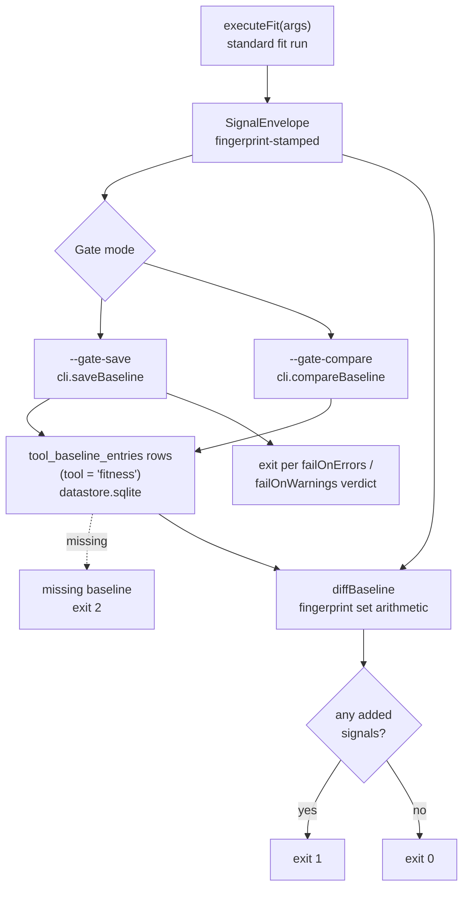

# Architecture gate

The gate is opensip-cli' answer to "we have legacy violations and we need to ship a regression detector before we can clean them up." Save a baseline today, compare next week, fail CI if anything new appeared. Ignore directives are too granular for hundreds of legacy sites; the gate handles the volume.

> **What you'll understand after this:**
> - The two-mode flow: `--gate-save` and `--gate-compare`.
> - The fingerprint identity and why line numbers are excluded.
> - Why the baseline is stored signals (host-owned tables), not a SARIF document.
> - The CI patterns that make the gate useful in practice.

---

## The two modes

```bash
opensip fit --gate-save                 # capture today's reality
opensip fit --gate-compare              # CI gate from now on
```

`--gate-save` runs the configured recipe, fingerprint-stamps the resulting `SignalEnvelope`, and hands it to the **host-owned baseline plane** (`cli.saveBaseline('fitness', envelope)`, ADR-0036): each finding lands as one row in the generic `tool_baseline_entries` table (scoped by a `tool` column, at `<project>/opensip-cli/.runtime/datastore.sqlite`), with a `tool_baseline_meta` row marking that a baseline exists. There is **exactly one baseline per tool per project**.

> **Baseline shape (ADR-0011 / ADR-0036).** The baseline stores the run's *signals* (fingerprint + full `Signal` payload per row) — **not** a SARIF document. The capture/ratchet/export machinery is host infrastructure shared by every tool: fitness contributes only its [`fingerprintStrategy`](../../../packages/fitness/engine/src/baseline-strategy.ts); the seams (`saveBaseline` / `compareBaseline` / `exportBaselineSarif`) and the [generic table pair](../../../packages/datastore/src/schema/baseline.ts) live in the host and `@opensip-cli/datastore`. `fit export --format baseline` re-renders the stored signals as SARIF via the root `cli.writeSarif` seam, so the on-disk CI artifact stays SARIF.

Baselines live in the project SQLite store under
`opensip-cli/.runtime/datastore.sqlite`; they are not committed SARIF files.
Run `--gate-save` once to capture the current bar, then use one of the
artifact-based CI patterns below to share the resulting report. See
[`80-implementation/03-session-and-persistence.md`](../80-implementation/03-session-and-persistence.md)
for the schema layout.

> **Exit code (ADR-0020).** `--gate-save` saves first, then exits according to the configured severity thresholds (`failOnErrors`/`failOnWarnings`) — it does **not** unconditionally exit 0. The CI step that records the baseline is therefore also an honest pass/fail signal; run any follow-up export/upload step under `if: always()` so the artifact survives a failed gate.

`--gate-compare` runs the same recipe, reads the saved baseline rows back, computes the diff, and prints a structured report:

```
opensip fit --gate-compare

Added (1):
  ✗ no-console-log                          services/api/src/routes/payments.ts:88
      console.log is forbidden in production

Resolved (3):
  ✓ no-todos                                services/api/src/lib/parser.ts
  ✓ complex-function                        services/api/src/legacy/auth.ts
  ✓ file-length-limit                       services/api/src/util/big.ts

Unchanged (29):
  · ... and 24 more

✗ DEGRADED — 1 new violation
```

Exit code 1 if `degraded` (any added findings, with the reserved `failOnDegraded` config key at its default `true`); 0 otherwise. Setting `failOnDegraded: false` turns the ratchet into a report-only diff. CI gates on the exit code; humans read the diff.

The flags are mutually exclusive — passing both raises a configuration error.



---

## The fingerprint identity

Two findings are "the same finding" iff `(filePath, ruleId, message)` matches exactly. Fitness declares this as its `Tool.fingerprintStrategy` (ADR-0036 — each tool stamps its own envelope; the host plane never re-fingerprints):

```ts
/** fitness's message-hash baseline identity: `sha256(filePath\nruleId\nmessage)`. */
export const fitnessFingerprintStrategy: FingerprintStrategy = (s) =>
  createHash('sha256').update(`${s.filePath}\n${s.ruleId}\n${s.message}`).digest('hex');
```

[`packages/fitness/engine/src/baseline-strategy.ts`](../../../packages/fitness/engine/src/baseline-strategy.ts). (Graph declares the opposite policy — a location-based key that *excludes* the message, because several graph rules embed run-varying counts in their message text. Both are correct for their domain; the strategy is per-tool, not a global algorithm.)

Three things stay in the hash:

- **`filePath`** — moving a file is a change. A finding at `src/a.ts` is different from a finding at `src/b.ts`.
- **`ruleId`** — different rules produce different signal types. `fit:no-console-log` and `fit:no-debugger` are different findings even at the same line.
- **`message`** — the violation's specific text. A complexity check that reports `cc=22` is different from one reporting `cc=28` at the same site, because the *content of the violation changed* — that's a real signal worth surfacing as added/resolved.

One thing is **deliberately excluded**: the line number. A regex check that flags `console.log` at line 42 today and the same `console.log` at line 50 next week (because lines were inserted above it) is the *same* violation. Including the line in the hash would produce false positives — an "added" finding (line 50) and a "resolved" finding (line 42) for what's really one unchanged issue.

The trade-off is symmetric: if a *different* `console.log` is added at the same file with the exact same message, the hash collides and we treat it as unchanged. In practice this hasn't been a problem — messages are usually specific enough that two distinct violations have different messages, and a duplicate-message-same-file pair is rare and benign.

The line-shift invariance is exercised by [`packages/fitness/engine/src/__tests__/baseline-plane.test.ts`](../../../packages/fitness/engine/src/__tests__/baseline-plane.test.ts) with explicit cases for the moved-line scenario and the changed-message scenario.

---

## What `--gate-compare` actually does

The compare is host machinery (ADR-0036): `cli.compareBaseline('fitness', envelope)` ([`packages/cli/src/bootstrap/baseline-seams.ts`](../../../packages/cli/src/bootstrap/baseline-seams.ts)) loads the saved rows for `tool = 'fitness'` (throwing a configuration error → exit 2 when no baseline exists), then runs the pure [`diffBaseline`](../../../packages/output/src/format/baseline-diff.ts) from `@opensip-cli/output`:

```ts
// diffBaseline(currentSignals, baselineRows) →
//   added       = current fingerprints  - baseline fingerprints
//   resolved    = baseline fingerprints - current fingerprints
//   unchanged   = current fingerprints  ∩ baseline fingerprints
//   degraded    = added.length > 0
```

The diff is set arithmetic on fingerprint-keyed collections. No fuzzy matching, no near-miss heuristic — the fingerprints match or they don't. This makes the gate's behavior easy to reason about: a one-line change to the message of a check makes every finding from that check appear as both added and resolved.

The `degraded` flag is `added.length > 0`. A run can resolve violations *and* add new ones, in which case it's still degraded — adding is the gate. Resolved counts are informational; they never cause the gate to fail.

---

## Tolerant baseline reading

Both the stored baseline rows and the current run reduce to the same fingerprint set before the diff. The fingerprint reads only the fields fitness's identity needs (`filePath`, `ruleId`, `message`) off each `signal` and ignores the rest:

- A signal with no location → `filePath = ''`. The fingerprint still works (line/column aren't in fitness's identity anyway).
- Extra signal fields (`category`, `provider`, `fixConfidence`, `metadata`, …) are ignored — they don't affect identity. (The full `Signal` is still stored as the row's `payload`, so the `resolved` bucket and the SARIF export can reconstruct the whole finding.)
- A saved-but-empty baseline (a clean codebase) → zero baseline fingerprints, but the `tool_baseline_meta` row still marks "a baseline exists"; every current signal reads as added.

The baseline is a rebuildable local cache (ADR-0006): the datastore is regenerated by re-running `--gate-save`, so there is no migration of pre-existing rows. If you need a text-shaped, hand-editable artifact (to grandfather a finding, or to commit to git), use `fit export --format baseline` to emit a SARIF file and one of the artifact-based CI patterns below.

---

## Where the gate lives in the lifecycle

```
opensip fit --gate-compare
  → fitnessTool command handler
       → if (opts.gateSave || opts.gateCompare) { runGateMode(args, cli); return; }
            → runGateMode (fit-modes.ts):
                 → executeFit(args)              ← same fit run, no special path
                      (the envelope arrives fingerprint-stamped: buildFitEnvelope
                       passes fitnessFingerprintStrategy to buildSignalEnvelope,
                       which stamps every signal at construction)
                 → if save: cli.saveBaseline('fitness', envelope)
                            deliverFitSignals(...)        ← exit per failOnErrors/failOnWarnings
                 → else:    cli.compareBaseline('fitness', envelope)
                            renderGateCompareOutput(result)
                            deliverFitSignals(..., result.degraded && failOnDegraded)
                                                          ← host sets exit 1 on degraded
```

The gate is a post-processing layer on top of the standard `executeFit()` run. It doesn't change which checks ran, which targets were resolved, or how filtering applied. It takes the same `SignalEnvelope` the renderer would have shown — already fingerprint-stamped at construction (`buildSignalEnvelope` stamps every signal with the tool's strategy, or the host default `ruleId|filePath|line|col` for a tool that declares none) — and hands it to the host seams. Note that fitness never calls `setExitCode` for the gate path (ADR-0035): the compare verdict rides into `deliverFitSignals` as the host's `runFailed` override, so a `--report-to` upload failure can never mask the gate verdict.

This is why ignore directives are compatible with the gate: a directive suppresses a violation *before* the signal enters the envelope, so the baseline doesn't see it and the compare doesn't see it. A new directive added today removes a finding from the current run; the gate reports it as resolved (since it was in the baseline). A directive removed today re-introduces a finding; the gate reports it as added.

---

## CI integration patterns

The baseline lives in `<project>/opensip-cli/.runtime/datastore.sqlite`, which is gitignored. To get a shared baseline across CI runs the SQLite store (or just its baseline payload) has to travel with the workflow. Two shapes that work in practice:

### Pattern 1 — rolling baseline via CI artifact

CI runs `--gate-save` on every main-branch build and uploads `<project>/opensip-cli/.runtime/datastore.sqlite` as a workflow artifact. PR runs download the most recent main artifact before invoking `--gate-compare`.

```yaml
# .github/workflows/main.yml (build a fresh baseline on main)
on: { push: { branches: [main] } }
jobs:
  baseline:
    steps:
      - uses: actions/checkout@v4
      - run: pnpm i --frozen-lockfile
      - run: opensip fit --gate-save
      - uses: actions/upload-artifact@v4
        if: always()   # gate-save exits non-zero on a fail-threshold breach (ADR-0020);
                       # the baseline still saved first, so publish it regardless
        with:
          name: fit-baseline
          path: opensip-cli/.runtime/datastore.sqlite
          retention-days: 30

# .github/workflows/pr.yml (gate every PR against the latest main baseline)
on: { pull_request: {} }
jobs:
  gate:
    steps:
      - uses: actions/checkout@v4
      - uses: dawidd6/action-download-artifact@v6
        with:
          workflow: main.yml
          name: fit-baseline
          path: opensip-cli/.runtime/
      - run: pnpm i --frozen-lockfile
      - run: opensip fit --gate-compare
```

PRs are graded against a moving target, but the target only goes down (main never adds violations, by construction). This is the closest equivalent to a committed-baseline workflow without committing runtime state.

### Pattern 2 — local-only baseline

The baseline lives in `.runtime/datastore.sqlite` (gitignored). Each developer's machine has its own baseline, regenerated as they work on long-lived branches. CI doesn't gate at all — `--gate-compare` is purely a local affordance.

This is the loosest shape. Useful for early adoption, where the team isn't yet ready to enforce the gate in CI but wants the regression-detection workflow as a personal tool.

> **Why no committed baseline file?** Because the baseline is a row in a SQLite database with WAL sidecars, committing it to git would mean committing a binary blob that diffs poorly and races on WAL writes. The artifact pattern above is the supported substitute. Teams that strongly need a text-shaped baseline in git can run `fit export --format baseline` to write the stored envelope as a SARIF file and commit that.

---

## When *not* to use the gate

A few patterns the gate isn't a fit for:

- **Brand-new project, zero violations.** Just enable the checks. Don't grandfather what doesn't exist.
- **Single check, single violation.** An ignore directive is more granular and more documentable than a baseline entry for one site.
- **Teams without a coverage culture.** The gate trusts the team to actually fix grandfathered violations eventually. Without that follow-through, the baseline grows monotonically and the gate becomes a rubber stamp.
- **Cross-project baselines.** Each baseline is project-scoped (the file paths are project-relative). A monorepo-wide baseline works only if every project's `cwd` is the monorepo root.

---

## Where the example lands

For `acme-api`:

- Day one: CI's main-branch workflow runs `opensip fit --gate-save` after merging the initial setup. The save records 142 pre-existing violations across the universal/typescript/python check packs as baseline rows in `.runtime/datastore.sqlite`, and CI uploads the SQLite file as the `fit-baseline` artifact.
- PR workflow: each PR job downloads the latest `fit-baseline` artifact into `opensip-cli/.runtime/`, then runs `opensip fit --gate-compare`.
- A PR that introduces one new `console.log` produces an `Added (1)` line and exits 1. The PR fails until the `console.log` is removed (or marked with `// @fitness-ignore-next-line no-console-log`).
- A PR that resolves four violations produces `Resolved (4)` and exits 0. The team merges; the next main-branch build re-runs `--gate-save` and the artifact rolls forward with the lower count.

Today's count: 78 violations in the baseline. The 64-violation gap from day one's 142 is nine months of gradual improvement, gated all the way.

---

## What's next

- **[`../70-reference/01-cli-commands.md`](../70-reference/01-cli-commands.md)** — every gate flag in the lookup-shaped reference.
- **[`../20-fit/04-output-gate-sarif.md`](../20-fit/04-output-gate-sarif.md)** — the wider context of fit output paths the gate fits into.
- **[`../20-fit/03-ignore-directives.md`](../20-fit/03-ignore-directives.md)** — when to use directives vs. baselining.
