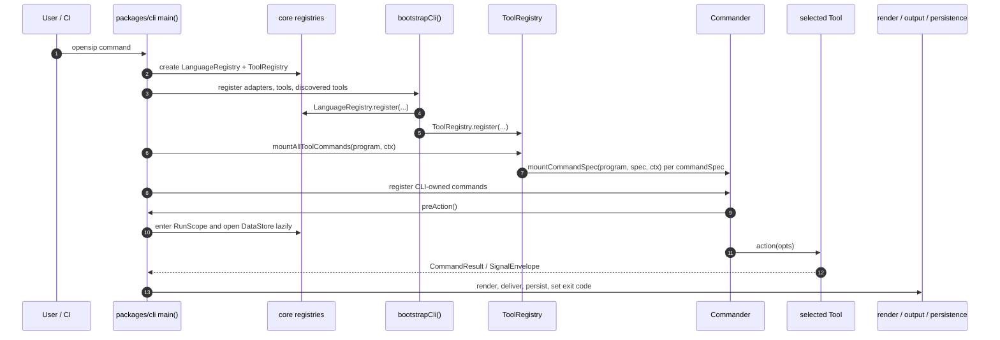

# NOTE (host-planes hygiene)
All host command paths (including sessions/* and agent-catalog) now execute after a RunScope has been entered via the pre-action hook (or explicit runWithScope in tests). The pre-scope holder is gone for production. Only the documented ToolCliContext seams may be used for output/state/hostPlanes. See the hygiene plan for details.
# CLI dispatch

`packages/cli/src/index.ts` is the binary's entry point. It does the same five things on every invocation and then hands argv to Commander. This doc walks those five things.

> **What you'll understand after this:**
> - The exact startup sequence, in order.
> - Which commands are CLI-owned (`init`, `report`, `config`, `sessions`, `tools`, `configure`, `agent-catalog`, `completion`, `uninstall`) vs. tool-owned (`fit`, `sim`, `graph`, `yagni`), and how the per-tool `<tool> plugin` groups mount under each pack-supporting tool primary.
> - The global flag set vs. per-command flags.
> - How the CLI handles errors before, during, and after Tool execution.

---

## The startup sequence

```
1. main() constructs fresh, per-invocation registries:
     - new LanguageRegistry()
     - new ToolRegistry()
     These replace the long-removed `defaultLanguageRegistry` /
     `defaultToolRegistry` module singletons; tools later read them
     via `cli.scope.languages` / `cli.scope.tools` (RunScope).
2. await bootstrapCli({ langRegistry, toolRegistry, projectDir }):
     a. Registers the bundled language adapters (typescript, rust,
        python, java, go, cpp) into langRegistry.
     b. Resolves and dynamically imports the first-party tool packages
        (@opensip-cli/fitness, @opensip-cli/simulation,
        @opensip-cli/graph, @opensip-cli/yagni) into toolRegistry.
     c. Walks node_modules via discoverToolPackages() to load any
        third-party packages whose package.json declares
        opensipTools.kind === 'tool'.
     d. Walks the two authored `tools/` roots via
        discoverAndRegisterAuthoredTools(): global
        `~/.opensip-cli/tools/` (trusted-by-default) then project
        `<project>/opensip-cli/tools/` (deny-by-default). Each
        `<name>/opensip-tool.manifest.json` sidecar is admitted —
        trust decision FIRST — before its module is imported.
3. mountAllToolCommands(toolRegistry,
                        program, ctx)       ← iterate the tool registry
                                              and mount each
                                              tool.commandSpecs entry
                                              via mountCommandSpec().
4. mountHostCommands()                      ← mount CLI-owned commands
                                              (init, report, config,
                                              sessions, tools, configure,
                                              agent-catalog, completion,
                                              uninstall), then hang
                                              each per-tool <tool>
                                              plugin group under its
                                              pack-supporting primary.
5. If argv has no subcommand, print the welcome banner and exit 0.
6. await program.parseAsync()
     The preAction hook enters a fresh RunScope, reads --debug from
     each command's options and raises the log level for that run. A
     runId is generated and the day-level log file
     (logs/<YYYY-MM-DD>.jsonl) is opened lazily on first write.
```

The same startup path as a sequence:



The entry point remains small ([`packages/cli/src/index.ts`](../../../packages/cli/src/index.ts)
is ~190 lines) and delegates the phase-heavy work to named bootstrap modules
such as `bootstrapCli`, `createPreActionHook`, and
`executePostBailoutBootstrap` (ADR-0052). There is still no DI container, but
startup now has explicit phase seams so scope construction, config validation,
capability loading, and host start effects are testable independently.
Bundled tools are **not** statically imported: the host lists their package names
in `BUNDLED_TOOL_PACKAGES` ([`bootstrap/bundled-manifest.ts`](../../../packages/cli/src/bootstrap/bundled-manifest.ts), re-exported from [`bootstrap/register-tools.ts`](../../../packages/cli/src/bootstrap/register-tools.ts))
and loads each through the same manifest → `admitTool` → dynamic-import →
register path an installed or project-local tool travels. "Bundled" is a trust
posture, not a privileged load path — a guardrail (`no-bootstrap-tool-import`)
fails CI if a static `import { fitnessTool }` creeps back in.

### Why this order

A few of the constraints that pinned the order:

- **Language adapters before any check ever runs.** The fitness tool's content filter dispatches per-file based on the language registry. A check that runs before any adapter is registered would treat every file as raw text and silently miss violations. The adapters are registered first inside `bootstrapCli()`, so they're in place before any tool is admitted and mounted.
- **First-party tools before discovery.** `ToolRegistry.register()` is **first-writer-wins** (`warn-first-wins`). `bootstrapCli()` admits the bundled tools first, so a same-id third-party package can't clobber a built-in: the first-writer policy keeps the incumbent (and warns), and the discovery walk via `discoverToolPackages()` *also* explicitly skips packages whose `metadata.id` matches a bundled tool. Both guards point the same way — bundled `fit`/`sim`/`graph`/`yagni` win.
- **Authored discovery is the third leg — bundled, then installed, then authored sidecars.** After the bundled + installed legs, `discoverAndRegisterAuthoredTools()` walks the two authored `tools/` roots and converges on the same `importToolRuntime` → `isValidTool` → `registry.register` path. It carries **two trust postures**: a global-authored tool (`~/.opensip-cli/tools/`) is trusted-by-default, while a project-authored tool (`<project>/opensip-cli/tools/`) is **deny-by-default** — admitted only when allowlisted via `OPENSIP_CLI_ALLOW_PROJECT_TOOLS`. The **trust decision always precedes the dynamic import**: an un-allowlisted project tool throws `PluginIncompatibleError` (exit 5) before its module is ever loaded, so a `git clone`-borne tool cannot run code by mere presence ([ADR-0030](../../decisions/ADR-0030-authored-tool-discovery.md)).
- **Tools mount before CLI-owned commands.** Tool subcommands (`fit`, `sim`, `graph`, `yagni`, …) get mounted in `mountAllToolCommands()` first from each tool's `commandSpecs`. CLI-owned commands (`init`, `report`, `config`, `sessions`, `tools`, `configure`, `agent-catalog`, `completion`, `uninstall`) are mounted afterwards in `mountHostCommands()`, also through `mountCommandSpec()` — which then hangs each per-tool `<tool> plugin` group under its tool primary via `mountToolPluginGroups()` (so there is no top-level `opensip plugin`). The order avoids duplicate-name collisions (a tool can't squat a CLI-owned name) and keeps tool subcommands at the top of `--help`.
- **`parseAsync` last.** Commander parses argv synchronously but action handlers are async. `parseAsync` returns when the action handler resolves, which is what blocks Node's event loop until the run completes.

---

## Concurrent in-process runs

The `RunScope` is bound to the current async context through one `AsyncLocalStorage` instance exported from `@opensip-cli/core`. There are two ways to bind it, with strict roles:

- **`enterScope(scope)` — the Commander single-command path only.** It is called exactly once per CLI invocation, in the pre-action hook, where the action body runs after the hook returns but in the same async chain. `enterScope` is backed by `AsyncLocalStorage.enterWith`, which mutates the single ALS slot for the rest of the async context — so it is safe only when nothing else is running in the process. **Never call `enterScope` while another scope task is in flight.** An always-on re-entrancy guard throws `SystemError` (`SYSTEM.SCOPE.REENTRANT`) if a *different* scope is already current; re-entering the *same* scope (idempotent) and entering when *none* is current are allowed.

- **`runWithScope(scope, fn)` / `runWithScopeSync(scope, fn)` — the concurrency-safe path.** These bind `scope` for the dynamic extent of `fn` via `AsyncLocalStorage.run`, so runs nest cleanly and never collide on the shared slot. **Concurrent in-process work — a SaaS host running several analyses at once, or any `Promise.all` over multiple runs — MUST use `runWithScope` per task and MUST NOT share `enterScope`.** Two overlapping runs each see their own scope for the dynamic extent of their `fn`; the always-on guard means a stray `enterScope` inside one of them fails loudly instead of silently cross-contaminating the other.

Per-run logs stay filterable for free on the same seam: each scope carries a distinct `runId`, and the logger reads `currentScope()?.runId` (wired via `setRunIdProvider(() => currentScope()?.runId)`), so concurrent runs emit non-colliding, per-`runId` log lines.

---

## CLI-owned commands

Some commands belong to the CLI itself, not to any Tool. They live under [`packages/cli/src/commands/`](../../../packages/cli/src/commands/) and are assembled by `mountHostCommands()` as host-owned `CommandSpec`s:

| Command | Owner | Why CLI-owned |
|---|---|---|
| `init` | CLI | Scaffolds the project layout. No Tool exists yet to own it. |
| `configure` | CLI | Manages user-level (`~/.opensip-cli/config.yml`) state. Cross-tool. |
| `uninstall` | CLI | Removes the user-level dotdir. Cross-tool. |
| `<tool> plugin add/remove/list/sync` | CLI (host) | Manages a pack-supporting tool's project-pinned extension packs. Mounted UNDER each pack-supporting tool primary (`opensip fit plugin …`, `opensip sim plugin …`) with the domain pre-bound — there is no top-level `opensip plugin`. Whole Tool plugins use `tools …` instead. |
| `completion` | CLI | Prints a shell-completion script whose subcommands + flags are **derived from the live `CommandSpec`s** at generation time (`assembleCompletionInventory`) — the same specs the runtime mounts, so it can't drift; a flag-parity test enforces it. Discovered third-party tool commands are included (the inventory is sourced from the populated registry). |
| `report` | CLI | Generates + opens the HTML report, aggregating each tool's contributed report data (composition root). Cross-tool. |
| `sessions list/purge` | CLI | Reads the runtime session store. Cross-tool. New agent ergonomics (`--summary-only`, `--filter`, `--raw` on show) are also host-owned here. |

Tool-owned commands are mounted from each Tool's declared `commandSpecs` via the
host's `mountCommandSpec`, in the canonical nested `<tool> <verb>` grammar. The
current first-party set: fitness contributes `fit` plus the nested `fit list`,
`fit recipes`, and `fit export` (`--format baseline`); simulation contributes
`sim` plus `sim recipes`; graph contributes `graph` plus the nested `graph list`,
`graph recipes`, `graph lookup`, `graph index`, and `graph export` (`--format
sarif|catalog|baseline`) (graph has its own `defineRule` + recipes, mirroring
fitness — ADR-0005), plus the internal `graph-shard-worker` /
`graph-equivalence-check` and the off-process live-run workers (`fit-run-worker`
/ `sim-run-worker` / `graph-run-worker`, ADR-0028). The nine legacy flat-root
aliases (`fit-list`, `graph-lookup`, `catalog-export`, `sarif-export`, …) were
removed once their deprecation window closed — `graph export --format
sarif|catalog` is the canonical machine-export surface. The `report` command is
**CLI-owned** (composition root), not a fitness command — it walks every tool's
`collectReportData`. Third-party tools add their own. The host owns the Commander
program and mounts each Tool's declared `commandSpecs`; the Tool decides what
commands and handlers it declares.

The split is functional, not arbitrary. CLI-owned commands deal with concerns that span every Tool — initialization, plugins, sessions, user config. Tool-owned commands deal with concerns specific to that Tool's domain. A new Tool doesn't need to provide its own `init`; it inherits the CLI's.

## Adding a host-owned command result

`CommandResult` is a closed discriminated union, and
[`resultToView`](../../../packages/cli/src/ui/result-to-view.ts) is exhaustively
checked. When a host-owned command needs a new result variant, update these
surfaces in the same change:

1. Add the result interface and union member in
   [`packages/contracts/src/command-results.ts`](../../../packages/contracts/src/command-results.ts).
2. Return that variant from the command handler or action body.
3. Add a `resultToView` switch case and a focused render test in
   `packages/cli/src/ui/__tests__/result-to-view.test.ts`.
4. If the result is machine-visible, update
   [`70-reference/04-json-output-schema.md`](../70-reference/04-json-output-schema.md).

Third-party or custom tool commands that only need lines of terminal output
should use the existing `text-lines` variant instead of adding a bespoke host
result type.

---

## Global flags

Two flags apply to every command, mounted on the program itself rather than per-command:

- **`--debug`** — set the logger to debug level. Read in step 1 (before logger init) so debug logs are captured from the very first event.
- **`--quiet`** — suppress banner and box rendering. Tool action handlers honor this when mounting Ink views.

Per-command flags (`--recipe`, `--check`, `--gate-save`, `--cwd`, etc.) live on each command's Commander definition. Flags are not inherited from program to subcommand — Commander requires them to be explicitly mounted at the level the user invokes them.

The `--help` text for the program lists every registered Tool's `commands[]`. The `--help` text for a specific command shows the per-command flags. Both are auto-generated by Commander from the metadata.

---

## The welcome screen

When the binary is invoked without arguments (or with bare `--help`), the CLI prints a welcome banner: the version, a short description of what `opensip-cli` does, and a numbered list of common next-step commands. Source: [`packages/cli/src/welcome.ts`](../../../packages/cli/src/welcome.ts).

The update check runs in the **pre-action hook**, so it fires on every command invocation but **not** on bare `opensip-cli` (the hook only runs for an actual subcommand; a zero-arg invocation short-circuits to the welcome screen and never reaches it). The hook calls `checkForUpdate`, which returns the newer published version (if any). When the **default `mini` banner** is active, that version is surfaced inline on the banner's version line as `(<new-version> available)` (in `theme.success`); for the other banner sizes — and the banner-less `--json` path — `formatUpdateNag` prints a one-line "update available" message to stderr instead. The check is skipped when stdout isn't a TTY, when `CI` is set, or when `OPENSIP_NO_UPDATE` / `NO_UPDATE_NOTIFIER` is set.

**Fetch vs. display are deliberately separated.** `update-notifier` is used only as the *fetcher*: it runs the rate-limited (once per 24 hours), detached, non-blocking network check and owns its own cache under `~/.config/configstore/`. But that package *deletes its cached result the moment it's read*, which would make the notice show at most once per daily cycle — easy to miss. So the newest known version is mirrored into a **sticky store** at `~/.opensip-cli/update-state.json` ([`packages/cli/src/update-state.ts`](../../../packages/cli/src/update-state.ts)), which `checkForUpdate` reads on **every** run. The notice therefore persists until the running version catches up, at which point the store is cleared in place and the notice stops on its own. The sticky file is tool-generated cache, kept separate from the user-authored `~/.opensip-cli/config.yml`. See [`packages/cli/src/update-notifier.ts`](../../../packages/cli/src/update-notifier.ts).

The banner does not appear when a command is invoked. It's strictly a no-argv affordance — running `opensip fit` skips the welcome and goes straight to the run.

---

## The error-suggestion mapping

When a Tool throws, the CLI passes the error to `getErrorSuggestion`, which pattern-matches the error message and returns a structured `{ message, action, exitCode }` suggestion (or `null` if no rule matched):

```ts
import { getErrorSuggestion } from '@opensip-cli/contracts';

// inside the action handler:
catch (error) {
  const suggestion = getErrorSuggestion(error);
  return suggestion
    ? { type: 'error', message: suggestion.message, suggestion: suggestion.action, exitCode: suggestion.exitCode }
    : { type: 'error', message: (error as Error).message, exitCode: 1 };
}
```

The suggestion is a one-line hint — "Run `opensip init` to create one." or "Check `opensip-cli.config.yml` for syntax errors." The mapping is centralized in [`packages/contracts/src/exit-codes.ts`](../../../packages/contracts/src/exit-codes.ts) so the same error message surfaces the same suggestion regardless of which Tool threw it.

This is the polite way the CLI extends Tool errors. The Tool just throws; the CLI does the message-matching and rendering.

---

## Failure paths

Things that can go wrong, and what the CLI does:

| Failure | When | What the CLI does |
|---|---|---|
| Invalid argv | Commander parse | Commander prints help; exit 1. |
| Tool command mounting throws (bundled) | `mountAllToolCommands()` | `PluginIncompatibleError` → exit 5; startup aborts. |
| Tool command mounting throws (external) | `mountAllToolCommands()` | Warn + `cli.tool.register_failed`; the failing tool is skipped; CLI continues with remaining tools. |
| Action handler throws | Inside Tool execution | Caught at the program level; rendered as `ErrorResult`; exit code from `error.exitCode` or 2. |
| Missing config | Tool action calls `loadProjectConfig()` | Tool throws `ConfigurationError`; CLI surfaces the error and the suggestion. Exit 2. |
| Plugin failed to load | Inside the Tool's lazy plugin loader (e.g. `ensureChecksLoaded` in fitness) | Logged; the failing plugin is skipped; CLI continues. |
| Missing baseline (gate) | `fit --gate-compare` with no baseline | Tool throws `GateBaselineMissingError`; CLI surfaces a hint to run `--gate-save`. Exit 2. |

The principle is "log, fall back, keep moving" for non-fatal failures (a plugin couldn't load, a Tool couldn't register) and "surface and exit" for fatal ones (no config, broken baseline, action handler crash). The CLI never silently swallows an error — every failure produces either a log line or a rendered error.

---

## Where the example lands

For `acme-api` running `opensip fit --gate-compare` from CI on 2026-05-17:

1. `main()` constructs fresh `LanguageRegistry` and `ToolRegistry` instances for this invocation.
2. `bootstrapCli({ langRegistry, toolRegistry, projectDir })`:
   - Registers six bundled language adapters (`typescript`, `rust`, `python`, `java`, `go`, `cpp`) into `langRegistry`.
   - Resolves each name in `BUNDLED_TOOL_PACKAGES` (`@opensip-cli/fitness`, `@opensip-cli/simulation`, `@opensip-cli/graph`, `@opensip-cli/yagni`) on disk, reads its manifest, admits it through `admitTool`, **dynamically imports** the tool runtime, and registers it into `toolRegistry` — the same path an installed tool takes; nothing is statically imported.
   - `discoverToolPackages()` walks `node_modules`. No third-party Tools installed. Returns empty.
3. `mountAllToolCommands(toolRegistry, program, ctx, provenance)`: for each registered tool,
   `mountCommandSpec` mounts every entry in the tool's declared `commandSpecs`,
   nesting `parent`-bearing specs under their tool primary. fitness's specs mount
   `fit` + the nested `fit list` / `fit recipes` / `fit export`; simulation's
   mount `sim` + `sim recipes`; graph's mount `graph` + the nested `graph list` /
   `graph recipes` / `graph lookup` / `graph index` / `graph export` (and its
   internal workers); yagni's spec mounts `yagni`. `commandSpecs` is the only
   command surface.
4. `mountHostCommands()`: host-owned `CommandSpec`s mount `init`, `report`, `config`, `sessions`, `tools`, `configure`, `agent-catalog`, `completion`, and `uninstall`, then `mountToolPluginGroups()` hangs each per-tool `<tool> plugin` group under its tool primary.
5. `argv = ['node', 'opensip-cli', 'fit', '--gate-compare']` — there's a subcommand, so the welcome banner is skipped.
6. `parseAsync()` runs. The `preAction` hook enters a fresh `RunScope`, reads the `fit` command's `opts.debug` (false), and leaves the log level at `info`. It also runs the once-per-day update check and records the result on the scope for the banner / stderr nag (no-op when up-to-date or offline; never blocks). A runId like `RUN_01HXYZG9V8K1J7P3M2N0RQS5T6W` is generated (uppercase prefix + ULID); the day-level log file `<project>/opensip-cli/.runtime/logs/2026-05-17.jsonl` is opened on first write. Commander dispatches to `fitnessTool`'s `fit` action handler with `--gate-compare = true`. The Tool runs `executeFit` and the gate diff. Exit code 1 (regression detected).

The whole bootstrap is ~30ms on a developer laptop; the run itself is the bulk of the wall-clock time.

---

## Worker resource ceilings (forked dispatch + live-engine workers)

External-tool dispatch (`__tool-command-worker`) and bundled live-engine subprocess
transport share governed resource ceilings via `WorkerLimits` env vars (read only
through `EnvRegistry`). Defaults are balanced for large-repo `fit` / `graph` runs
and env-tunable when a legitimate run hits a cap.

| Variable | Default | Purpose |
|---|---|---|
| `OPENSIP_CLI_WORKER_TIMEOUT_MS` | `120000` | Per-run wall-clock hard cap (not reset per host-RPC upcall). |
| `OPENSIP_CLI_WORKER_MAX_IPC_BYTES` | `33554432` (32 MiB) | Serialized IPC payload cap (worker send + host receive). |
| `OPENSIP_CLI_WORKER_MAX_OLD_SPACE_MB` | `4096` | V8 old-space cap (`--max-old-space-size`) for forked workers. |
| `OPENSIP_CLI_WORKER_MAX_RSS_MB` | `6144` | RSS watchdog ceiling; exceeded → child-tree SIGKILL. |
| `OPENSIP_CLI_WORKER_MAX_CONCURRENT_RPC` | `1` | Concurrent in-flight host-RPC upcalls (dispatch path). |
| `OPENSIP_CLI_WORKER_MAX_TOTAL_RPC` | `5000` | Total host-RPC upcalls per dispatch run. |
| `OPENSIP_CLI_WORKER_HEARTBEAT_GRACE_MS` | `60000` | Missed heartbeat grace before `heartbeat_missed` kill. |
| `OPENSIP_CLI_WORKER_IDLE_RPC_MS` | *(unset)* | Optional per-upcall idle timer; off by default. |
| `OPENSIP_CLI_WORKER_MAX_CAPTURED_OUTPUT_BYTES` | `33554432` (32 MiB) | `ResultAccumulator` + captured stderr cap. |
| `OPENSIP_CLI_WORKER_STDERR_INHERIT` | `0` | Set to `1` to inherit child stderr (debugging). Default captures a truncated stderr tail on worker fault. |

On settle, timeout, limit breach, or Ctrl-C, the supervisor kills the **whole child
tree** (POSIX process-group kill; Windows `taskkill /T /F`). Limit kills surface as
structured `failureClass` values on parent-side errors (`timeout`, `payload_too_large`,
`rss_exceeded`, `rpc_flood`, `heartbeat_missed`, `cancelled`) — never an in-host
fallback for external tools (ADR-0054).

---

## What's next

- **[`02-plugin-loader.md`](./02-plugin-loader.md)** — what happens inside `loadDiscoveredTools()` and inside the Tool's lazy plugin loading.
- **[`03-session-and-persistence.md`](./03-session-and-persistence.md)** — what gets written to disk during and after a run.
- **[`../70-reference/01-cli-commands.md`](../70-reference/01-cli-commands.md)** — the lookup-shaped reference for every command and flag.
