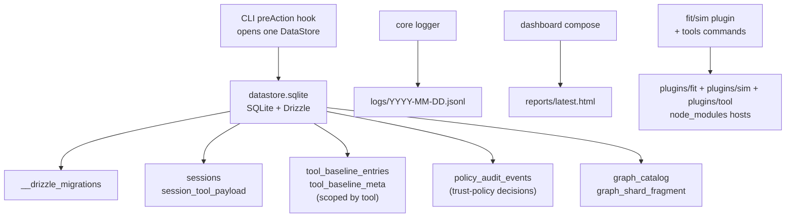

# Session and persistence

An active runtime can contain a SQLite database, structured logs, HTML reports,
raw tool artifacts, rebuildable caches, optional CPU profiles, and
initialized-project plugin hosts. A command's selected mode determines which
records or files it actually writes. Host-managed implicit state lives under one
active **runtime root**; explicit export/SARIF paths and profile-directory
overrides may point elsewhere. Before initialization the active root is in the
managed user cache; after initialization it is the project's gitignored
`.runtime/` directory.

> **What you'll understand after this:**
> - The on-disk layout and what's stored where.
> - Tool-produced data (sessions, catalog, baselines) → SQLite via `DataStore`.
> - Logs and reports stay as files; rendering channels for external consumers.
> - The schema-migration model and the upgrade / downgrade contract.

---

## Runtime mode is not a storage tier

`opensip init` is a command that changes the project's state; “Init” is not a
storage location. Keep these dimensions separate:

| Customer state | Runtime root | Whole-root lifecycle |
|---|---|---|
| **Zero-config project** | `~/.opensip-cli/cache/ephemeral/<project-key>/` | Managed cache entry; automatically evictable |
| **Initialized project** | `<project>/opensip-cli/.runtime/` | Project-local; no whole-cache eviction policy |

Despite the internal `ephemeral` directory name, the user-cache runtime is real
file-backed persistence. It survives normal process exits and reboots. What
makes it cache storage is its lifecycle: the CLI may remove the whole project
entry when its project path disappears, after 30 days without use, or under the
project-count policy. The entry active during pruning is protected while up to
50 other survivors are retained. Pruning is best-effort, so these are eviction
rules—not an archival promise or an exact deletion schedule.

The initialized project runtime uses the same SQLite schema and runtime-file
layout. It is attached to the working copy and exempt from the extra whole-cache
eviction pass, but it is still local, gitignored, and governed by ordinary
record/artifact retention. Its caches and catalogs are rebuildable; retained
sessions, baselines, tool state, and other evidence are not. Initialization
makes project intent explicit and project-bound; it does not make evidence
permanent or share it through Git.

OpenSIP Cloud is optional and additive. Connecting Cloud does not replace the
local runtime or imply that every local file is uploaded.

## The runtime dir layout

```
<runtime-root>/
├── project.json                                ← managed-cache entry only: project path + last-used time
├── datastore.sqlite                            ← single SQLite store for tool-produced data
├── datastore.sqlite-wal                        ← WAL journal (created when writes are in flight)
├── datastore.sqlite-shm                        ← shared-memory page (companion to WAL)
├── cache/                                      ← AST, graph, and other rebuildable caches
├── artifacts/<tool>/                           ← retained raw external-tool artifacts
├── reports/latest.html                         ← convenience alias for the latest unselected report
├── reports/runs/<sha256>.html                  ← run-addressed exact `report --run` / audit --open artifact
├── logs/<YYYY-MM-DD>.jsonl                     ← one log file per local day, shared across runs
├── profiles/                                   ← optional CPU profiles
└── plugins/                                    ← initialized-project npm plugin hosts
    ├── fit/node_modules/
    ├── sim/node_modules/
    └── tool/node_modules/
```

Source of truth: [`packages/core/src/lib/paths.ts`](../../../packages/core/src/lib/paths.ts).
Cross-mode host-owned persistence consumers route through
`resolveRuntimePathsForScope(...)`, which selects the managed user cache or
project-local root without changing the shared subdirectory contract.
Project-only plugin/adapter paths and profiling have bounded, specialized path
selection. Directories are created lazily by their first consumer.

The WAL/SHM sidecar files are SQLite implementation details (Write-Ahead Log mode, enabled at open time so concurrent reads — e.g. from `graph --workspace` child processes — don't block writes). They may be empty or absent after a clean shutdown depending on SQLite's WAL checkpoint timing; both states are normal.

---

## The DataStore

[`packages/datastore`](../../../packages/datastore) hosts the persistence kernel: a `DataStore` interface, a SQLite-backed implementation, an in-memory implementation for tests, and the workspace-wide migration store under `migrations/`. The CLI bootstrap installs a lazy per-scope datastore accessor; the first consumer opens at most one `DataStore`, and RunScope teardown disposes it. Help, discovery, and other datastore-free paths need not open SQLite. Tool commands do not receive a raw datastore handle on `ToolCliContext`; they use the entered `RunScope` for read-owned internals and the host-owned seams (`toolState`, baseline/export seams, `writeArtifact`) for durable writes.

The public `DataStore` is deliberately opaque: lifecycle, maintenance, and
serialized write-lock coordination only. Raw Drizzle handles, table values, and
transaction callbacks remain behind `@opensip-cli/datastore/internal` for the
datastore owner, session-store, and graph persistence. General Tool/CLI business
logic goes through repositories or documented host seams
([ADR-0147](../../decisions/ADR-0147-public-graph-read-and-fail-closed-package-boundaries.md)).

Schemas are owned by the package that produces the data — datastore is paradigm-agnostic infrastructure — **with one deliberate exception**: baseline persistence is a host-owned plane (ADR-0036). A tool that wants tool-specific tables (like graph's catalog cache) adds a schema module under its `src/persistence/schema.ts` and registers it in [`packages/datastore/drizzle.config.ts`](../../../packages/datastore/drizzle.config.ts); a tool that wants the **gate** (`--gate-save`/`--gate-compare`/export) adds *no schema at all* — it inherits the generic `tool_baseline_entries` / `tool_baseline_meta` pair (scoped by a `tool` column, [`packages/datastore/src/schema/baseline.ts`](../../../packages/datastore/src/schema/baseline.ts)) by stamping fingerprints on its signals. The schema registrations today:

| Owner | Schema file | Tables |
|---|---|---|
| `@opensip-cli/session-store` | `src/schema/sessions.ts` | `sessions`, `session_tool_payload` |
| `@opensip-cli/graph` | `src/persistence/schema.ts` | `graph_catalog`, `graph_shard_fragment` |
| `@opensip-cli/datastore` (host) | `src/schema/baseline.ts` | `tool_baseline_entries`, `tool_baseline_meta` (all tools' gate baselines) |
| `@opensip-cli/datastore` (host) | `src/schema/policy-audit.ts` | `policy_audit_events` (local trust-policy decisions) |

`__drizzle_migrations` is a fourth, internal table — Drizzle uses it to record which migrations have been applied. (The historical per-tool baseline tables — `fit_baseline`, `graph_baseline_signals`, `graph_baseline_meta` — were dropped by migration when ADR-0036 landed; baselines are drop-and-recapture, so a re-run of `--gate-save` rebuilds them in the generic pair.)



SQLite + Drizzle were chosen because the runtime store is local, project-scoped, transactional, and small enough to rebuild if a user needs to delete it. A remote database, JSON-as-backend, or a broader persistence abstraction would add operational weight without improving the CLI's local-first behavior.

File-backed SQLite stores are opened with `auto_vacuum=INCREMENTAL` and expose a
host-only maintenance seam for `incrementalVacuum`, bounded full `VACUUM`, and
file-size measurement. The in-memory test store does not expose maintenance.
Existing file stores are converted on open with a one-time `VACUUM`; conversion
failure is logged and non-fatal.

---

## Reserved host-plane state

Ordinary Tool state and host compatibility state share the `tool_state` table
but not an identity. Tool-owned rows use validated canonical/layout/stable keys;
host compatibility rows use `@opensip-cli/host-plane:<toolId>`. One shared
reserved-prefix predicate rejects that namespace during runtime Tool admission,
owned-key derivation, binding, and explicit purge input before handler or state
access. A bound Tool therefore cannot overwrite or enumerate its host rows.

Migration `0009_host_plane_namespace` copies recognized legacy compatibility
rows into the reserved identity. It preserves payload bytes and timestamps,
does not delete the legacy row, never overwrites an existing reserved row, and
is idempotent, including stored JSON `null`. This copy-only posture avoids
guessing whether an ambiguous legacy key was host- or Tool-owned
([ADR-0146](../../decisions/ADR-0146-host-plane-reserved-state-namespace.md)).

`opensip tools data-purge <tool-id>` resolves the Tool's admitted owned keys and
clears sessions, baselines, ordinary state, and the corresponding reserved host
compatibility rows. The reserved identity itself is never accepted as a command
argument.

---

## Sessions

A session is one record per `fit`, `sim`, `graph`, or `yagni` run. The persistence layer holds **zero tool-specific vocabulary** (audit 2026-05-29, session split): the `sessions` table carries only the columns every tool shares, and per-session detail lives in a separate `session_tool_payload` row as an **opaque JSON blob** whose shape is owned and validated by the writing tool. The `StoredSession` interface in [`packages/contracts/src/session-types.ts`](../../../packages/contracts/src/session-types.ts) is what `SessionRepo` round-trips:

```ts
interface StoredSession {
  readonly id: string;
  readonly tool: string;                    // ToolShortId; first-party rows include fit/sim/graph/yagni
  readonly startedAt: string;                // host-stamped: wall-clock run start
  readonly completedAt: string;              // host-stamped: when the tool returned to the host
  readonly cwd: string;
  readonly recipe?: string;
  readonly score: number;
  readonly passed: boolean;
  readonly durationMs: number;               // host-stamped: canonical monotonic duration (not TTY-busy)
  readonly hostMetrics?: StoredSessionHostMetrics;  // host-side overhead, hydrated from a sibling record
  readonly payload?: unknown;                // tool-owned opaque detail; contracts never inspects it
}
```

The lifecycle timing (`startedAt` / `completedAt` / `durationMs`) and `hostMetrics` are **host-owned** — the writing tool supplies only `tool` / `cwd` / `recipe?` / `score` / `passed` / `payload?` (see [Host-owned run timing](#host-owned-run-timing-adr-0051--host-owned-run-timing-plan) below).

The old per-check / per-finding columns (`session_checks`, `session_findings`) are gone — that detail now rides inside `payload` (checks, findings, summaries, etc. for `fit`; whatever shape each tool defines). `contracts` treats `payload` as `unknown`; the dashboard, as presentation owner, reads and renders it — the same producer/consumer split used for `GraphCatalog`.

Tool payloads follow a documented inner `__version` convention for evolution (see `StoredSession` JSDoc in contracts, the per-tool `build*SessionPayload` implementations, and `ToolStateRepo` JSDoc). Legacy rows are projected with `fidelity: 'projection'`. See the payload-schema-evolution plan and ADR-0050.

The session is written via [`SessionRepo.save()`](../../../packages/session-store/src/session-repo.ts) inside a single transaction (the `sessions` row plus, when `payload` is present, one `session_tool_payload` row), so even a run that crashes mid-render leaves a complete or no record — never a partial one.

### The `sessions` command

```bash
opensip sessions list                       # SELECT * FROM sessions ORDER BY timestamp DESC
opensip sessions list --json --summary-only # lean listing for agents (omits heavy payloads)
opensip sessions show <id>                  # replay a stored session (or `latest --tool <name>`)
opensip sessions show latest --tool fit --json --filter errors-only --filter top:20
opensip sessions purge                      # DELETE FROM sessions (prompts for confirm)
opensip sessions purge --older-than 7       # DELETE FROM sessions WHERE timestamp < cutoff
opensip sessions purge -y                   # skip the confirmation prompt
```

`purge` is **row-level data deletion**, not file removal. The FK cascade from `sessions` → `session_tool_payload` (`onDelete: 'cascade'`) ensures that purging a session drops its opaque payload row in one shot.

### Automatic retention

The host applies automatic session/datastore retention after it records a run
session. This is controlled by `cli.sessions` in
`opensip-cli.config.yml`:

```yaml
cli:
  sessions:
    keep: 200        # newest sessions to keep; 0 disables count pruning
    maxAgeDays: 60   # oldest allowed age; 0 disables age pruning
    maxSizeMb: 150   # SQLite size guard; 0 disables size guard
```

The policy is conjunctive: a session can be dropped because it is outside the
newest `keep` rows or older than `maxAgeDays`. After deletes, the host runs
incremental SQLite reclaim when the backend supports it. If the database remains
larger than `maxSizeMb`, the host logs a warning, runs one full vacuum, and may
prune to a smaller bounded keep count before a final full vacuum. It does not
loop.

The retention policy is resolved from the entered run scope's project config:
`opensip fit --cwd <project>` uses `<project>/opensip-cli.config.yml`, never the
invoking directory's config. Only scope-less fallback paths consult
`process.cwd()`. The host emits `session.retention.policy_resolved` as a debug
diagnostic in the `persist` phase with `source`, `keep`, `maxAgeDays`, and
`maxSizeMb`.

Retention is best-effort. A prune, file-lock, size-check, or vacuum failure is
logged under `session.retention.*`, but it never changes the primary tool
verdict, session write result, or process exit code. Tools do not call this
maintenance path directly; the host owns it per ADR-0096.

This record-level policy applies independently of the active runtime location.
The managed user cache has an additional whole-entry policy that initialized
project runtimes do not: at most once per day, cache hygiene may remove entries
whose project path no longer exists, entries unused for more than 30 days, then
the oldest survivors under a count policy that retains up to 50 entries in
addition to the protected active entry. It never removes the entry backing the
run in progress. The outer cache policy is host-owned rather than controlled by
one project's config because it governs a cross-project user directory.

## Policy audit events

The trust-policy plane records bounded local evidence in
`policy_audit_events`. Events are produced by host policy-enforcement points
only: installed/authored Tool admission, capability-pack admission,
`tools install`, strict `fitness.disabledChecks` handling, baseline capture, and
`policy explain`. Tools never write this table directly.

Events are buffered on `RunScope.policyAudit` during the command and flushed by
the host before the datastore close disposer. `opensip policy audit --json`
reads the table newest-first; `--out <path>` writes the same command result JSON
through the host artifact writer. Retention is bounded in the repository layer
so the audit surface stays local and small.

The dashboard reads the same store to populate its run-history view. For programmatic discovery of these surfaces (especially the new agent ergonomics around filtering and raw output), see `agent-catalog` in the [CLI commands reference](../70-reference/01-cli-commands.md).

**Session replay.** `sessions show` (and the per-run `--show <session>`
shorthand on `fit`/`graph`/`sim`) reconstructs a past run's output from its
stored payload when that tool contributes a `sessionReplay` hook. The opaque
payload is decoded back into its structural shape by the shared
`decodeSessionPayload` in [`@opensip-cli/session-store`](../../../packages/session-store/src/session-payload-decode.ts)
— persistence owns the structural decode but still holds **zero tool
vocabulary**. The replay-capable first-party tools then project that structure
into a `SignalEnvelope` (`fit`/`graph`/`sim` today), tagging the result
`fidelity: 'projection'` (rebuilt from persisted findings, not re-executed).
Failures (`not-found`, `wrong-tool`, `ambiguous-latest`, `decode-error`) surface
as a structured `CommandOutcome` error with exit 2.

The `--filter` (errors-only / warnings-only / top:<n>) and `--raw` options on `show`, plus `--summary-only` on `list`, provide agent-friendly ergonomics for historical result inspection without changing any human-readable output.

---

## The graph catalog

`@opensip-cli/graph` builds a call-graph catalog (functions, occurrences, calls) and persists it via [`CatalogRepo`](../../../packages/graph/engine/src/persistence/catalog-repo.ts). The store keeps the whole catalog as a single SQLite row; metadata fields (language, cache key, files fingerprint) are lifted into typed columns so the orchestrator can fingerprint-mismatch without parsing the payload.

### The derived `features` surface (ADR-0006)

The persisted catalog document carries an optional **`features`** layer — derived columns the engine computes from the raw catalog: per-function `bodyLines` / `blast` (direct + transitive blast radius) / reachability flags, per-package coupling degrees, SCC membership, and directed package-coupling edges. The contract shape is [`GraphFeatures`](../../../packages/contracts/src/graph-catalog.ts) (structurally mirrored from the engine's `PersistedFeatures` so the decoupled dashboard reads features without importing `@opensip-cli/graph`).

The persistence policy is **materialize only when forced** (ADR-0006): features are a *plain view* recomputed on demand for in-engine rules, and **materialized into the catalog JSON only for the columns the decoupled dashboard renders** (blast, SCC, package coupling). The `features` field is therefore present only on catalogs produced by a dashboard-bound run; the dashboard falls back to a no-data state when it's absent. Everything else (callers/callees indexes) is recomputed cheaply on every load and never stored.

The `--workspace` runner spawns one child process per workspace unit (per adapter `discoverWorkspaceUnits`). Each child opens its own `DataStore` against the shared `datastore.sqlite` file. WAL mode permits concurrent readers + one writer, so the parallelism is safe but serialized at the catalog write boundary — per-unit incremental writes are deferred to a follow-up `graph-catalog-perf` plan.

The `--no-cache` flag forces a cache miss; the existing fingerprint-based invalidation path runs even when `datastore.sqlite` is present and current.

### Task-context derived snapshots and parent manifests

Task context spans two deliberately separate owners. Graph persists immutable
inventory and test-selection payloads in `graph_context_snapshot`; each row has
an exact id/kind/payload version, source/config identity, byte count, and JSON
payload. Writes reject payloads above 8 MiB, retain at most three rows per kind,
and prune deterministically until total retained bytes are at most 24 MiB.
Snapshot payloads contain facts and labelled static evidence, never source,
raw manifests, environment values, or unsafe script text.

The CLI aggregates only bounded contribution metadata. It preallocates the
parent Run and RunStep identities, builds `TaskContextManifest`, then writes the
same ids to `runs.context_manifest` and ordered `run_steps.evidence`. The parent
manifest is capped at 16 planes/64 KiB. Snapshot write precedes parent write, so
a failed parent transaction can leave an orphan; bounded age/size retention can
eventually remove old rows, including orphans and referenced snapshots. A
failed snapshot write cannot yield a successful contribution. There is no
cross-owner transaction and no context Tool session.

`get_context_status` reads the exact project-root/name parent Run through
session-store, validates its stored step references, and asks graph only whether
each recorded pointer is still available. For a retained inventory pointer it
also compares a freshly computed, content-free inventory identity; a mismatch
is stale and the newer identity is not disclosed. It never substitutes latest.
Old Runs have no manifest; an evicted snapshot leaves the parent Run available
but marks that exact pointer missing with a conservative rerun action. Callers
must require response `status: available`, `fileScope.status: matched`,
`manifest.readiness: ready`, and current, complete, uncapped required planes
whose exact pointers all replay as `available` before trusting the context.

---

## Host-owned run timing (ADR-0051 / host-owned-run-timing plan)

`StoredSession.startedAt`, `completedAt`, and `durationMs` are produced exclusively by the host from a single `RunTimer` (a.k.a. `RunLifecycle`). The host run plane (`packages/cli/src/bootstrap/run-plane.ts`) creates the lifecycle inside the command action — after `RunScope` entry, before any tool handler or `renderLive` — and freezes it (`complete()`, idempotent) once the tool returns. Tools read the timer only for a **display clock** via `ToolCliContext.runSession.timing` (also passed as the optional second `LiveViewContext` arg to live renderers registered with `cli.registerLiveView`). There is **no** generic-session writer on the context.

**The contribution model.** A tool RECORDS a run by RETURNING a `ToolRunCompletion` from its command handler or live renderer — `{ result?, envelope?, session?, execution? }`. Its `session` is a `ToolSessionContribution` `{ tool, cwd, recipe?, score, passed, payload? }` (no timing). The host run plane then stamps the frozen `startedAt`/`completedAt`/`durationMs`, generates the id via `generatePrefixedId(tool)`, writes via `SessionRepo`, records `persistMs` on the sibling host-metrics record, and (for a live run) records `ttyBusyMs`. Persistence is best-effort: no datastore ⇒ no row, never throws, never affects the result or exit code. A subprocess supervisor may return `execution: { kind: 'delegated', startedAt }`, but the host suppresses its standalone ledger row only after proving that a child row with the same run correlation, tool, and command began no earlier than that delegation; an unproven delegation remains a missing-evidence fault.

For primary verdict-producing analysis commands, prefer
`defineAnalysisRunCommand` from `@opensip-cli/contracts`. The tool's `session`
adapter returns only the `ToolSessionContribution`; the helper carries it back
through `ToolRunCompletion`, and the host run plane remains the only writer of
generic timing and persistence. This keeps static runs, live runs, gate modes,
SARIF side output, and report opening on the same host-owned return path
([ADR-0117](../../decisions/ADR-0117-host-owned-analysis-run-pipeline.md)).

### Clock taxonomy

| Clock | Owner | Where it lives |
| --- | --- | --- |
| `startedAt` / `completedAt` / `durationMs` | **host** RunTimer | `StoredSession` generic columns |
| `persistMs` / `ttyBusyMs` / `renderMs` / `egressMs` / `totalCommandMs` | **host** run plane | sibling `StoredSessionHostMetrics`, hydrated onto `StoredSession.hostMetrics` |
| per-unit / per-stage / per-recipe / profile timers | **tool** | the tool's opaque `payload` (or `collectReportData`) |
| SignalEnvelope `createdAt` / verdict duration | **tool** | the tool's `SignalEnvelope` artifact |

**Rules enforced by the `architecture-session-timing-not-host-owned` fitness check (path-gated to the first-party tool packages) + hygiene:**
- First-party tool code must not reference the generic-session persistence surface — `SessionRepo`, any `persist*Session` helper (removed in Phase 3), or a `runSession.record(...)` writer (removed in Phase 6). There is no tool-side generic-session writer.
- Internal per-unit/stage/recipe/profile timers and the tool's own SignalEnvelope timing are explicitly allowed and encouraged for diagnostics — they stay in the tool's payload / envelope / `collectReportData` and never feed the generic columns. (Read helpers like `resolveSession` / `decodeSessionPayload` for replay are likewise fine.)

The live and static render paths (via `RunTimingProvider` in cli-ui + `RunSummary` reading the provider when `durationMs` is omitted, and static `result-to-view` falling back to a host snapshot) ensure the "Duration X" line the user sees is the same value that ends up in `sessions list`, `sessions show`, and the HTML report.

See [ADR-0051](../../decisions/ADR-0051-host-owned-run-lifecycle-timing.md) and the cross-cutting contracts in the host-owned-run-timing plan for the full seam, logging, and hardening details.

## Declared inputs manifest

Every new host-emitted run envelope is stamped with a compact
`declaredInputs` manifest before JSON outcome rendering, delivery, SARIF
reporting, and report composition. The manifest records only allowlisted
runtime facts: CLI version, Node version, package-manager identity, platform,
tool id, available engine/tool version, and baseline fingerprint identity.

This is verdict provenance for CI and AI agents. It explains common "same code,
different result" skew without dumping environment variables, absolute paths, or
secrets. Older/no-manifest producers may omit the field; absence means
"unknown", not "defaults". See [ADR-0097](../../decisions/ADR-0097-gate-verdict-determinism.md).

---

## The gate baselines (host-owned plane, ADR-0036)

All tools' gate baselines live in **one generic table pair** in the SQLite store, scoped by a `tool` column:

- **`tool_baseline_entries`** — one row per finding: `(tool, fingerprint)` composite key plus the full `Signal` JSON payload (the payload feeds the `resolved` diff bucket and the SARIF re-render). `fit --gate-save` writes rows with `tool = 'fitness'`; `graph --gate-save` with `tool = 'graph'`. Save is a per-tool delete-all + bulk-insert (atomic replace).
- **`tool_baseline_meta`** — a per-tool existence marker + capture timestamp, so an empty-but-saved baseline (a clean codebase) reports `exists() === true`.

The capture (`--gate-save`), ratchet (`--gate-compare`), and export (SARIF + JSON fingerprints) machinery are host seams (`saveBaseline`/`compareBaseline`/`exportBaselineSarif`/`exportBaselineFingerprints` on `ToolCliContext`) over the generic [`BaselineRepo`](../../../packages/datastore/src/baseline-repo.ts) plus the pure `diffBaseline` in `@opensip-cli/output`. A tool inherits the whole gate by stamping fingerprints on its signals — it authors at most a `Tool.fingerprintStrategy` (fitness: `sha256(filePath\nruleId\nmessage)`, line-shift tolerant; graph: `ruleId|filePath|line|column`, message-excluded) and **no schema, no repo, no diff code**.

### Baselines live in SQLite

Each tool has at most one saved baseline per active local runtime in the SQLite database.
`--gate-save` replaces that tool's baseline rows; `--gate-compare` compares the
current run against the saved rows. SARIF remains an export format, not the
baseline store.

---

## Logs

Structured JSON Lines, one event per line. Written to two destinations simultaneously:

1. **stderr** — for live observation (`opensip fit 2>&1 | jq`).
2. **`<runtime-root>/logs/<YYYY-MM-DD>.jsonl`** — one file per local day; every run on the same day appends to the same file. The runtime root is the managed user cache before initialization and the project-local `.runtime/` afterward. Filter with `jq` on the `runId` field to isolate a specific run.

The logger is in [`packages/core/src/lib/logger.ts`](../../../packages/core/src/lib/logger.ts). Every log entry carries:

- `evt` — the event name (`cli.fit.run.start`, `session.save.complete`, etc.).
- `module` — the module that emitted it (`cli:fit`, `contracts:session-repo`, …).
- `runId` — the per-run correlation id.
- Plus event-specific fields.

Persistence call sites emit structured events with stable `evt:` names: `session.save.complete` / `.list.complete` / `.purge.complete`, `graph.baseline.save.complete` / `.load.complete` / `.load.miss`, `graph.catalog.read.hit` / `.read.miss` / `.write.complete`, `fit.baseline.save.complete` / `.load.complete` / `.load.miss`. Observability did not regress with the storage swap.

There is no per-file log rotation. In an initialized project, logs remain until
the user removes them or the runtime. For a zero-config project, logs can also
disappear when the whole managed cache entry is evicted. `sessions purge`
deletes session rows but leaves logs alone, by design.

---

## Reports

The HTML report writes self-contained files under `<runtime-root>/reports/`.
Unselected composition rewrites `latest.html` as a convenience alias. Exact
`report --run` / `audit --open` selections write run-addressed artifacts under
`reports/runs/<sha256>.html` (domain-separated hash of the opaque Run ID), return
and launch that path, and may refresh `latest.html` without sharing the browser
target. Missing/pruned IDs fail closed; non-audit retained Runs fail as
change-impact-unavailable. Orphan run-addressed files are pruned best-effort when
their Run is no longer retained. `opensip report` and `--open` resolve the same
active runtime as the analysis command, so managed-cache reports work before
initialization without writing project files.

Composition is owned by the **CLI** ([`packages/cli/src/report-compose.ts`](../../../packages/cli/src/report-compose.ts)), the cross-tool composition root. It reads sessions via `SessionRepo.list({ limit: 20 })`, then walks every registered tool's optional `collectReportData(scope)` seam and merges the keyed contributions into one `DashboardInput` — graph returns its `graphCatalog` (via `CatalogRepo.loadCatalogContract()`), fitness returns its catalogs, neither reaching into the other (this is what the `fitness-no-graph` / `graph-no-fitness` layer rules enforce). The merged input is handed to `generateDashboardHtml` ([`@opensip-cli/dashboard`](../../../packages/dashboard/src/generator.ts)), which assembles the inlined HTML (JS via `<script type="module">`, CSS via `<style>`, session/catalog data via `<script type="application/json">`). The output is one self-contained file you can email — no CDN, no asset bundle, no server.

The report hook fires after an eligible analysis run only when `--open` was
requested and browser policy accepts it. The explicit `opensip report` command
always composes a snapshot and opens it by default unless `--no-open` or `--json`
is selected.

---

## Upgrade behavior

Whenever an invocation opens the active datastore, `DataStoreFactory.open()`
applies any pending Drizzle migrations. Migrations are content-hashed and
idempotent. Users see no extra step; the first datastore-using command on a new
opensip-cli version brings that store up to date. After a successful migrate it
stamps the SQLite header (`PRAGMA user_version`) with the number of migrations
this build ships.

**Downgrades across schema changes are unsupported** — Drizzle has no down-migration concept, and an older CLI cannot detect a newer schema on its own (its migrations are a prefix of what was applied, so `migrate()` no-ops and later queries hit missing columns). The version stamp closes that gap: on open, a CLI whose supported version is behind the on-disk stamp fails fast with `DataStoreVersionError`, whose message offers two recoveries — upgrade the CLI (`curl -fsSL https://opensip.ai/cli/install.sh | bash`), or delete the active `<runtime-root>/datastore.sqlite` to continue on the older CLI. Cacheable data can rebuild, but session history, saved baselines, tool state, and other retained database evidence are lost. The forward direction (newer CLI, older or pre-guard `user_version 0` DB) auto-migrates and re-stamps with no user action.

If opening or migrating fails for other reasons (corrupted DB header, unwritable directory), the CLI surfaces a `DataStoreMigrationError` with the same delete-to-recover hint.

---

## Lifecycle commands and what they touch

A reference for "I want to free disk / I'm debugging."

| Command | Touches |
|---|---|
| `opensip sessions list` | `SELECT FROM sessions` |
| `opensip sessions purge --older-than N` | Against the active local evidence store (user cache before Init, project runtime after), `DELETE FROM sessions WHERE timestamp < cutoff` (FK cascades to the tool-payload row). Parent Runs and other runtime state remain. |
| `opensip fit --no-cache` / `graph --no-cache` | Forces cache miss; rebuilds full catalog/results, ignores any cached row |
| `opensip uninstall --project [path]` | Removes generated project runtime state and the matching zero-config user-cache runtime while preserving project config/authored content unless `--purge` is passed. Session/log history, baselines, tool state, and other retained evidence in those runtimes are lost. On Windows, ensure no opensip-cli process is active; open handles can block WAL/SHM removal. |
| `opensip uninstall` (no flag) | Removes `~/.opensip-cli/`, including user config, user-global tools/plugins, and every managed user-cache runtime/database. |
| Manual `rm <runtime-root>/datastore.sqlite*` | Wipes the active local DB. Cacheable records can rebuild; session history, saved baselines, tool state, and other retained database evidence are lost. |

`opensip init` can recreate the standard scaffold under
`<project>/opensip-cli/`, but deleting the whole directory also removes authored
checks, recipes, scenarios, and tools that the scaffold cannot recover. Preserve
or commit authored content first.

---

## What's next

- **[`../10-concepts/05-architecture-gate.md`](../10-concepts/05-architecture-gate.md)** — the gate's full behavior and the baseline format.
- **[`../70-reference/06-dashboard.md`](../70-reference/06-dashboard.md)** — the HTML report's structure and the `report` command.
- **[`../70-reference/03-configuration.md`](../70-reference/03-configuration.md)** — `opensip-cli.config.yml` schema (the one bit of project state that's not in `.runtime/`).
- **[`../80-implementation/05-layer-policy.md`](../80-implementation/05-layer-policy.md)** — where datastore sits in the workspace layering.
