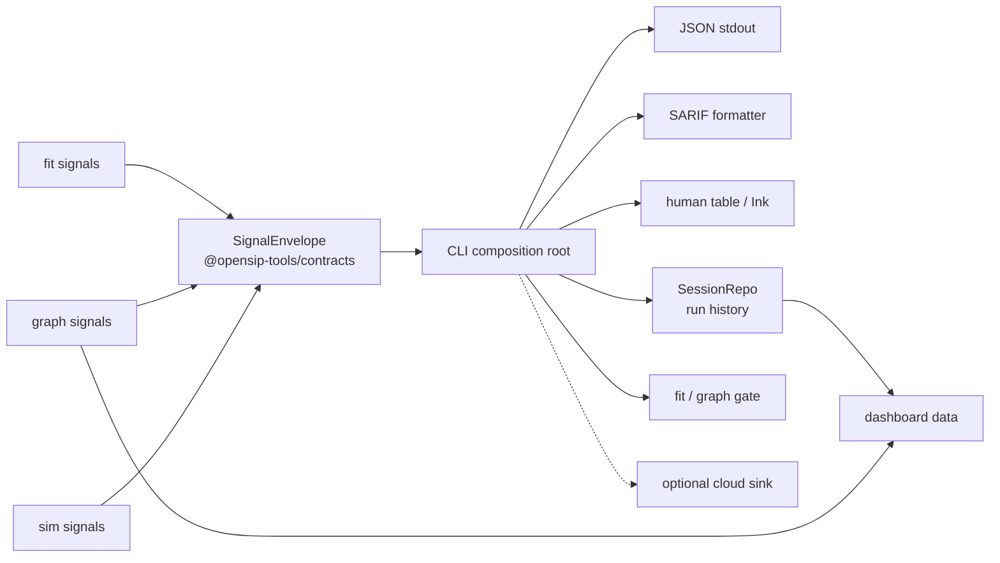

# Contract surfaces

A contract is a promise to a consumer outside your control. Break it, and the consumer breaks. opensip-tools has six contract surfaces. Knowing what they are tells you what you can change freely (everything else) and what's expensive to change (these).

> **What you'll understand after this:**
> - The six surfaces opensip-tools commits to.
> - Who consumes each one.
> - The stability tier each surface sits at.
> - The shape and rationale of each.

---

## The six surfaces

| # | Surface | Consumers | Stability tier | Shape lives in |
|---|---|---|---|---|
| 1 | CLI argv (commands and flags) | humans, CI, shells | **stable** (semver-major) | `packages/*/src/*tool.ts` |
| 2 | Exit codes | CI, scripts | **stable** (semver-major) | `packages/contracts/src/exit-codes.ts` |
| 3 | JSON output (`SignalEnvelope`) | CI, dashboards, the gate, OpenSIP Cloud | **stable** (semver-major) | `packages/contracts/src/signal-envelope.ts` |
| 4 | SARIF output | GitHub Code Scanning, IDEs | **stable** (versioned by SARIF spec) | `packages/output/src/format/signal-sarif.ts` |
| 5 | Tool plugin contract (`Tool`) | third-party tools | **stable** (semver-major) | `packages/core/src/tools/types.ts` |
| 6 | Plugin discovery (`opensipTools.kind` markers; exact check-package pins; sim `scenarios-*` scope scan) | third-party tools, check packs, sim packs | **stable** (semver-major) | `packages/core/src/plugins/tool-package-discovery.ts`, `packages/fitness/engine/src/plugins/check-package-discovery.ts`, `packages/simulation/engine/src/plugins/scenario-package-discovery.ts` |

Anything else — internal types, framework helpers, the recipe registry shape, the language-adapter content-filter API — is **internal**. It can move between minors. Don't depend on it from outside the workspace; if you do, you're on your own when it shifts.

---

## 1. CLI argv

The command tree and flag surface. What `opensip-tools --help` shows.

```
opensip-tools
├── fit                    (run fitness checks)
│   ├── --recipe <name>
│   ├── --check <slug>
│   ├── --tags <list>
│   ├── --json
│   ├── --verbose
│   ├── --gate-save        (writes baseline row into .runtime/datastore.sqlite)
│   ├── --gate-compare
│   └── … (see fit-list, fit-recipes for catalogs)
├── sim                    (run simulation scenarios — experimental)
├── graph [paths...]       (static call-graph + dead-end analysis)
│   ├── --json
│   ├── --no-cache
│   ├── --gate-save
│   ├── --gate-compare
│   ├── --workspace             (fan-out across detected workspace units)
│   ├── --concurrency <n>       (cap for --workspace)
│   └── --language <name>       (force a specific adapter)
├── init                   (scaffold the project)
├── dashboard              (open the HTML report)
├── sessions
│   ├── list
│   └── purge
├── plugin
│   ├── list
│   ├── add <pkg>
│   ├── remove <pkg>
│   └── sync
├── configure              (cloud API key)
├── completion             (shell completion script)
├── uninstall              (remove ~/.opensip-tools/)
├── fit-list               (alias: list-checks)
└── fit-recipes            (alias: list-recipes)
```

Each command's flag list is owned by the Tool that registers it. `fit` flags live in [`packages/fitness/engine/src/tool.ts`](https://github.com/opensip-ai/opensip-tools/blob/v2.12.0/packages/fitness/engine/src/tool.ts); `sim` flags in [`packages/simulation/engine/src/tool.ts`](https://github.com/opensip-ai/opensip-tools/blob/v2.12.0/packages/simulation/engine/src/tool.ts); `graph` flags in [`packages/graph/engine/src/tool.ts`](https://github.com/opensip-ai/opensip-tools/blob/v2.12.0/packages/graph/engine/src/tool.ts); top-level commands like `init`, `plugin`, and `configure` live in [`packages/cli/src/commands/`](https://github.com/opensip-ai/opensip-tools/blob/v2.12.0/packages/cli/src/commands/).

**Stability rule.** Removing a flag, removing a command, or changing a default value is a major-version change. Adding a flag with a safe default is a minor. Renaming a flag with an alias for the old name (the way `fit-list` aliases `list-checks`) is a minor; renaming without an alias is a major.

---

## 2. Exit codes

The integer the binary returns when it ends. Defined exactly once in [`packages/contracts/src/exit-codes.ts`](https://github.com/opensip-ai/opensip-tools/blob/v2.12.0/packages/contracts/src/exit-codes.ts):

| Code | Constant | Meaning |
|---|---|---|
| `0` | `SUCCESS` | Run completed; no failing checks. |
| `1` | `RUNTIME_ERROR` | Run completed; checks failed (violations found). |
| `2` | `CONFIGURATION_ERROR` | Run could not start (config invalid, plugin failed to load, baseline missing). |
| `3` | `CHECK_NOT_FOUND` | `--check <slug>` did not match any registered check. |
| `4` | `REPORT_FAILED` | `--report-to` upload failed (network error or non-2xx). |

CI integrations are the primary consumer. `opensip-tools fit && deploy` is an idiom; so is `opensip-tools fit --gate-compare || (echo "regression" && exit 1)`.

**Stability rule.** Adding new codes is a minor change provided the additions stay above 2 (consumers that switch on `0/1/2` continue to work; codes 3 and 4 are reserved for the specialized failure modes documented above). Re-purposing or removing an existing code is a major change. The convention is "0 = green, 1 = red but expected, 2 = red and unexpected" — anything that breaks that mental model breaks consumers.

---

## 3. JSON output (`SignalEnvelope`)

The structured stdout when `--json` is set — the **same envelope for every tool** (`fit`, `sim`, `graph`), per [ADR-0011](https://github.com/opensip-ai/opensip-tools/blob/v2.12.0/docs/decisions/ADR-0011-signal-output-currency-formatter-sink.md). Shape lives at [`packages/contracts/src/signal-envelope.ts`](https://github.com/opensip-ai/opensip-tools/blob/v2.12.0/packages/contracts/src/signal-envelope.ts):



```ts
interface SignalEnvelope {
  readonly schemaVersion: 2;
  readonly tool: 'fit' | 'sim' | 'graph';
  readonly recipe?: string;
  readonly runId: string;
  readonly createdAt: string;            // ISO 8601
  readonly verdict: {
    readonly score: number;
    readonly passed: boolean;            // no critical/high signals
    readonly summary: { total: number; passed: number; failed: number; errors: number; warnings: number };
  };
  readonly units: readonly UnitResult[]; // per-unit ran/errored/timing facts
  readonly signals: readonly Signal[];   // the flat findings list (4-level severity)
  readonly resolutionMode?: 'exact' | 'fast'; // graph-only
}
```

`Signal` is the single output currency (`packages/core/src/types/signal.ts`): 4-level severity (`critical|high|medium|low`), `category`, `provider`, `fingerprint`, fix hint. The `schemaVersion: 2` discriminator is part of the contract; it replaces the retired v1 `CliOutput` (`version: '1.0'`). A future minor can add fields; a major can change `schemaVersion` and break old consumers.

The full per-field reference (when each field is present, what each value can be) **and the v1 `CliOutput` → v2 `SignalEnvelope` mapping** are in [`70-reference/04-json-output-schema.md`](/docs/opensip-tools/70-reference/04-json-output-schema/).

**Stability rule.** Adding optional fields is a minor change. Adding required fields, removing fields, or changing types is a major change. Reordering keys within objects is *not* part of the contract — consumers must parse, not pattern-match — but in practice the renderer emits keys in declared order.

---

## 4. SARIF output

SARIF 2.1.0 is produced by the single shared `formatSignalSarif` formatter ([`packages/output/src/format/signal-sarif.ts`](https://github.com/opensip-ai/opensip-tools/blob/v2.12.0/packages/output/src/format/signal-sarif.ts)) — reached via the `cli.writeSarif` seam by `--report-to`, by `fit-baseline-export`, and by `graph --sarif <path>` (the gate baselines themselves are stored as signals in SQLite, not SARIF; see surface 3 and the gate doc). Note `graph-baseline-export` is *not* a SARIF producer — it exports the graph gate **fingerprint** baseline as JSON for git-trackable enforcement; graph's SARIF comes from `graph --sarif`. The shape is the SARIF spec's, not ours — opensip-tools commits to producing valid SARIF 2.1.0, not to a custom shape. Consumers (GitHub Code Scanning, VS Code SARIF Viewer, custom CI tooling) can read these files with any SARIF parser.

**Stability rule.** The fields opensip-tools fills in are: `runs[0].tool.driver.name = 'opensip-tools-<tool>'`, `runs[0].results[]` carrying `ruleId`, `message.text`, `level` (`critical`/`high` → `error`; `medium` → `warning`; `low` → `note`), and `locations[].physicalLocation.{artifactLocation, region}`. Future versions may fill in more SARIF fields; we won't stop filling in those.

The gate's identity hash for diff matching is **not** SARIF-spec — it's an opensip-tools internal: `sha256(filePath + '\n' + ruleId + '\n' + message)`, deliberately excluding line numbers so unrelated line shifts don't register as added/resolved. See [`packages/fitness/engine/src/gate.ts:243`](https://github.com/opensip-ai/opensip-tools/blob/v2.12.0/packages/fitness/engine/src/gate.ts) and [`10-concepts/05-architecture-gate.md`](/docs/opensip-tools/10-concepts/05-architecture-gate/).

---

## 5. The Tool plugin contract

Discussed at length in [`02-tool-plugin-model.md`](/docs/opensip-tools/10-concepts/02-tool-plugin-model/). The interface lives at [`packages/core/src/tools/types.ts`](https://github.com/opensip-ai/opensip-tools/blob/v2.12.0/packages/core/src/tools/types.ts):

```ts
interface Tool {
  readonly metadata: ToolMetadata;
  readonly commands: readonly ToolCommandDescriptor[];
  readonly register: (cli: ToolCliContext) => void;
  readonly initialize?: () => Promise<void>;
}
```

Plus the `ToolCliContext` injected when the CLI calls `register()`.

**Stability rule.** Adding optional fields to `Tool` (like `initialize?`) is a minor change. Adding required fields is a major. Adding methods to `ToolCliContext` is a minor (existing tools won't call them); removing or renaming methods is a major.

Why this surface is so narrow: every byte of it is a constraint on every Tool author for the lifetime of the contract. The five-field shape is the smallest viable Tool API. If you find yourself wanting a sixth, ask whether it's really a Tool concern or a CLI-side helper.

---

## 6. Plugin discovery

opensip-tools discovers third-party packages two different ways depending on what you're shipping:

### Tools — explicit marker in `package.json`

```json
{
  "name": "@yourorg/your-tool",
  "main": "dist/index.js",
  "opensipTools": { "kind": "tool" }
}
```

The kernel's [`discoverToolPackages`](https://github.com/opensip-ai/opensip-tools/blob/v2.12.0/packages/core/src/plugins/tool-package-discovery.ts) walks `node_modules` looking for the `opensipTools.kind === 'tool'` marker. The package's main entry must export a `tool: Tool` symbol.

### Check packs — `opensipTools.kind` marker

```json
{
  "name": "@opensip-tools/checks-mything",
  "opensipTools": { "kind": "fit-pack" },
  "main": "dist/index.js"
}
```

The canonical contract is the `opensipTools.kind: "fit-pack"` marker ([ADR-0007](https://github.com/opensip-ai/opensip-tools/blob/v2.12.0/docs/decisions/ADR-0007-marker-canonical-plugin-discovery.md)). The fitness engine discovers marker-declared packs from project `node_modules`; `plugins.checkPackages:` can additionally name exact packages that do not declare the marker yet. The old `@opensip-tools/checks-*` name-prefix scan has been removed. All first-party `@opensip-tools/checks-*` packs carry the marker. A pack's main entry must export `checks: Check[]`, optionally `recipes: FitnessRecipe[]`, and optionally `checkDisplay: Record<string, [icon, name]>`.

For packs published under your own scope, declare the marker or pin the package explicitly in the project config:

```yaml
plugins:
  checkPackages:
    - '@my-org/fitness-checks'      # exact-name supplement for non-marker packages
```

Marker-based discovery always runs; `plugins.checkPackages:` is an exact-name supplement for non-marker packages.

### Sim scenario packs

Use the same marker shape with `opensipTools.kind: "sim-pack"`. Sim also supports `<scope>/scenarios-*` discovery under `@opensip-tools` plus configured `plugins.packageScopes`, and the reproducible project-pinned shape (`plugins.sim:`) managed by `plugin add/remove/sync`.

### Stability rules

- **Adding a new auto-discovery shape is a minor change.** Existing packs don't break.
- **Changing what an existing shape requires is a major change.** A pack declaring `opensipTools.kind: "fit-pack"` that exports `checks: Check[]` should keep working across minors.
- **The Tool marker (`opensipTools.kind: 'tool'`) is a stable surface.** A future fifth kind would be a deliberate addition, not an accident.

A tool's project-local plugin layout is described by a `PluginLayout` descriptor (`{ domain, userSubdirs }` — [`packages/core/src/plugins/types.ts`](https://github.com/opensip-ai/opensip-tools/blob/v2.12.0/packages/core/src/plugins/types.ts)) that the tool declares on its `Tool.pluginLayout` and the kernel consumes. The `domain` is a plain string segment used for path resolution (`<project>/opensip-tools/<domain>/<kind>/` and `.runtime/plugins/<domain>/`), not a `package.json` `kind` value. The kernel deliberately does **not** enumerate the first-party domains — there is no `'fit' | 'sim' | 'lang'` union in core (ADR-0009 corollary 1).

---

## What's *not* a contract

It's worth being explicit about what isn't promised:

- **Internal framework types.** `CheckConfig`, `FitnessRecipe`, `RecipeCheckResult`, `ExecutionContext`, `PathMatcher` — all internal. They live in `@opensip-tools/fitness`, but they're not re-exported as part of the marketplace shape. Check packs use `defineCheck`/`defineRecipe` (which *are* stable) and never touch these.
- **Logger output format.** Logs are JSON Lines, but the field set is internal. Don't grep production logs for specific keys; treat them as opaque.
- **Cache file format.** The AST cache, the glob cache, the prewarm cache — all rebuildable. They have on-disk shapes, but those shapes change without notice. Wiping `<project>/opensip-tools/.runtime/cache/` is always safe.
- **Session record format.** Sessions are persisted as rows in the project-local SQLite datastore (`<project>/opensip-tools/.runtime/datastore.sqlite`) via `SessionRepo`, with per-session detail in a companion `session_tool_payload` row, but the schema is internal. The `sessions list` command is the supported reader.
- **OpenSIP Cloud API.** The cloud is a separate product. Its API is its own contract, not opensip-tools'. The CLI POSTs signals (the `SignalBatch` wire shape derived from the envelope; SARIF on the `--report-to` path), and the cloud is responsible for ingesting it.

---

## What this means for you

If you write a tool, a check pack, or a CI integration:

- **Lean on the six surfaces above.** Anything in this doc is safe to depend on. Read the linked source files for the precise shape.
- **Don't import internal types.** If you find yourself wanting `import { CheckConfig } from '@opensip-tools/fitness'`, take a step back — that import will move under your feet. Use `defineCheck()` instead, or open an issue to expose what you need as a stable surface.
- **Pin to majors.** `peerDependencies: { "@opensip-tools/core": "^1.0.0" }` is the right shape. Patch and minor are safe; major is a deliberate migration.
- **Test against `--json`, not against the table renderer.** The table renderer is for humans; the JSON output is the contract. Your CI integration parses JSON.

---

## What's next

You've now seen the four mental-model docs:

1. [`01-fitness-loop.md`](/docs/opensip-tools/10-concepts/01-fitness-loop/) — the spine, eight stages.
2. [`02-tool-plugin-model.md`](/docs/opensip-tools/10-concepts/02-tool-plugin-model/) — how the CLI doesn't know what `fit` does.
3. [`03-modular-monolith.md`](/docs/opensip-tools/10-concepts/03-modular-monolith/) — five layers, 30 packages.
4. This doc — the public edges.

Time to go deeper. Section [`20-fit/`](/docs/opensip-tools/20-fit/) expands stages 4–8 of the loop with full code paths. Section [`30-sim/`](/docs/opensip-tools/30-sim/) does the same for `sim`. Sections 40+ cover runtime mechanics, subsystems, surfaces, reference, and conventions.
