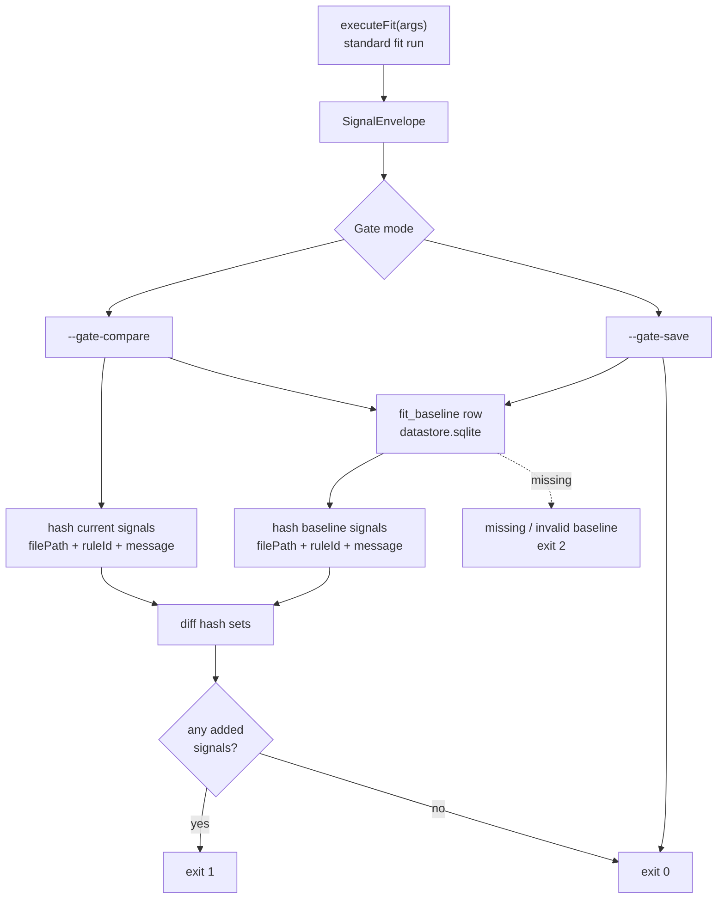

# Architecture gate

The gate is opensip-tools' answer to "we have legacy violations and we need to ship a regression detector before we can clean them up." Save a baseline today, compare next week, fail CI if anything new appeared. Ignore directives are too granular for hundreds of legacy sites; the gate handles the volume.

> **What you'll understand after this:**
> - The two-mode flow: `--gate-save` and `--gate-compare`.
> - The identity hash and why line numbers are excluded.
> - Why the v2 baseline is a stored `SignalEnvelope`, not a SARIF document.
> - The CI patterns that make the gate useful in practice.

---

## The two modes

```bash
opensip-tools fit --gate-save                 # capture today's reality
opensip-tools fit --gate-compare              # CI gate from now on
```

`--gate-save` runs the configured recipe and stores the resulting `SignalEnvelope` into the project's SQLite store (`fit_baseline` table at `<project>/opensip-tools/.runtime/datastore.sqlite`, via [`FitBaselineRepo`](https://github.com/opensip-ai/opensip-tools/blob/v2.7.1/packages/fitness/engine/src/persistence/baseline-repo.ts)). There is **exactly one baseline per project**.

> **Baseline shape (ADR-0011).** The v2 baseline stores the run's `SignalEnvelope` (its `signals`) directly — **not** a SARIF document — mirroring graph's signal-keyed baseline. This keeps fitness off any `@opensip-tools/output` production dependency: the composition root owns all SARIF egress. `fit-baseline-export` reads the stored envelope back and writes a SARIF file via the root `cli.writeSarif` seam, so the on-disk CI artifact stays SARIF.

> **v1 → v2 break.** v1 wrote baselines as SARIF *files* (`baseline.sarif`) and let users override the path with `--baseline <path>`. **The `--baseline` flag is gone in v2.** Teams that committed `baseline.sarif` to git for cross-CI gate comparisons should re-run `--gate-save` once on v2, then adopt one of the artifact-based CI patterns below. See [`80-implementation/03-session-and-persistence.md`](/docs/opensip-tools/80-implementation/03-session-and-persistence/) for the schema layout.

`--gate-compare` runs the same recipe, reads the saved baseline from the SQLite store, computes the diff, and prints a structured report:

```
opensip-tools fit --gate-compare

Added (1):
  ✗ no-console-log                          services/api/src/routes/payments.ts:88
      console.log is forbidden in production

Resolved (3):
  ✓ no-todos                                services/api/src/lib/parser.ts
  ✓ complex-function                        services/api/src/legacy/auth.ts
  ✓ file-length-limit                       services/api/src/util/big.ts

Unchanged (29):
  · ... and 24 more

✗ DEGRADED — 1 new violation
```

Exit code 1 if `degraded` (any added findings); 0 otherwise. CI gates on the exit code; humans read the diff.

The flags are mutually exclusive — passing both raises a configuration error.



---

## The identity hash

Two findings are "the same finding" iff `(filePath, ruleId, message)` matches exactly. The hash:

```ts
function hashViolation(filePath: string, ruleId: string, message: string): string {
  return createHash('sha256').update(`${filePath}\n${ruleId}\n${message}`).digest('hex');
}
```

[`packages/fitness/engine/src/gate.ts:243`](https://github.com/opensip-ai/opensip-tools/blob/v2.7.1/packages/fitness/engine/src/gate.ts).

Three things stay in the hash:

- **`filePath`** — moving a file is a change. A finding at `src/a.ts` is different from a finding at `src/b.ts`.
- **`ruleId`** — different rules produce different signal types. `fit:no-console-log` and `fit:no-debugger` are different findings even at the same line.
- **`message`** — the violation's specific text. A complexity check that reports `cc=22` is different from one reporting `cc=28` at the same site, because the *content of the violation changed* — that's a real signal worth surfacing as added/resolved.

One thing is **deliberately excluded**: the line number. A regex check that flags `console.log` at line 42 today and the same `console.log` at line 50 next week (because lines were inserted above it) is the *same* violation. Including the line in the hash would produce false positives — an "added" finding (line 50) and a "resolved" finding (line 42) for what's really one unchanged issue.

The trade-off is symmetric: if a *different* `console.log` is added at the same file with the exact same message, the hash collides and we treat it as unchanged. In practice this hasn't been a problem — messages are usually specific enough that two distinct violations have different messages, and a duplicate-message-same-file pair is rare and benign.

The line-shift invariance is exercised by [`packages/fitness/engine/src/__tests__/gate.test.ts:222`](https://github.com/opensip-ai/opensip-tools/blob/v2.7.1/packages/fitness/engine/src/__tests__/gate.test.ts) with explicit cases for the moved-line scenario and the changed-message scenario.

---

## What `compareToBaseline` actually does

[`packages/fitness/engine/src/gate.ts`](https://github.com/opensip-ai/opensip-tools/blob/v2.7.1/packages/fitness/engine/src/gate.ts):

```ts
export function compareToBaseline(envelope: SignalEnvelope, repo: FitBaselineRepo): GateCompareResult {
  // 1. Throw GateBaselineMissingError if repo.load() returns null.
  // 2. Read the stored baseline envelope from the fit_baseline row.
  //    Throw GateBaselineInvalidError on bad input.
  // 3. Extract baseline violations from baseline.signals (extractViolationsFromStoredBaseline).
  // 4. Extract current violations from envelope.signals (extractViolationsFromEnvelope).
  // 5. Hash both lists into Maps keyed by hash.
  // 6. Diff:
  //      added       = current.keys() - baseline.keys()
  //      resolved    = baseline.keys() - current.keys()
  //      unchanged   = current.keys() ∩ baseline.keys()
  // 7. Return { added, resolved, unchanged, degraded: added.length > 0 }
}
```

The diff is set arithmetic on hash-keyed collections. No fuzzy matching, no near-miss heuristic — the hashes match or they don't. This makes the gate's behavior easy to reason about: a one-line change to the message of a check makes every finding from that check appear as both added and resolved.

The `degraded` flag is `added.length > 0`. A run can resolve violations *and* add new ones, in which case it's still degraded — adding is the gate. Resolved counts are informational; they never cause the gate to fail.

---

## Tolerant baseline reading

Both the stored baseline envelope and the current run reduce to the same hashed violation list before the diff. `extractViolationsFromStoredBaseline` and `extractViolationsFromEnvelope` ([`packages/fitness/engine/src/gate.ts`](https://github.com/opensip-ai/opensip-tools/blob/v2.7.1/packages/fitness/engine/src/gate.ts)) read only the fields the identity hash needs (`filePath`, `ruleId`, `message`) off each `signal` and ignore the rest:

- A signal with no location → `filePath = ''`. The hash still works (line/column aren't in the hash anyway).
- Extra signal fields (`category`, `provider`, `fixConfidence`, `metadata`, …) are ignored — they don't affect identity.
- A baseline envelope with an empty `signals` list → zero baseline violations; every current signal reads as added.

The baseline is a rebuildable local cache (ADR-0006): the datastore is regenerated by re-running `--gate-save`, so there is no migration of pre-existing rows. If you need a text-shaped, hand-editable artifact (to grandfather a finding, or to commit to git), use `fit-baseline-export` to emit a SARIF file and one of the artifact-based CI patterns below.

---

## Where the gate lives in the lifecycle

```
opensip-tools fit --gate-compare
  → fitnessTool.action(opts)
       → if (opts.gateSave || opts.gateCompare) { runGateMode(args, cli); return; }
            → runGateMode:
                 → executeFit(args)              ← same fit run, no special path
                 → if save: saveBaseline(output, baselinePath)
                 → else:    compareToBaseline(output, baselinePath)
                            renderGateCompareOutput(result)
                            cli.setExitCode(result.degraded ? 1 : 0)
```

The gate is a post-processing layer on top of the standard `executeFit()` run. It doesn't change which checks ran, which targets were resolved, or how filtering applied. It just takes the same `SignalEnvelope` the renderer would have shown and runs the diff.

This is why ignore directives are compatible with the gate: a directive suppresses a violation *before* the signal enters the envelope, so the baseline doesn't see it and the compare doesn't see it. A new directive added today removes a finding from the current run; the gate reports it as resolved (since it was in the baseline). A directive removed today re-introduces a finding; the gate reports it as added.

---

## CI integration patterns

In v2 the baseline lives in `<project>/opensip-tools/.runtime/datastore.sqlite`, which is gitignored. To get a shared baseline across CI runs the SQLite store (or just its baseline payload) has to travel with the workflow. Two shapes that work in practice:

### Pattern 1 — rolling baseline via CI artifact

CI runs `--gate-save` on every main-branch build and uploads `<project>/opensip-tools/.runtime/datastore.sqlite` as a workflow artifact. PR runs download the most recent main artifact before invoking `--gate-compare`.

```yaml
# .github/workflows/main.yml (build a fresh baseline on main)
on: { push: { branches: [main] } }
jobs:
  baseline:
    steps:
      - uses: actions/checkout@v4
      - run: pnpm install --frozen-lockfile
      - run: opensip-tools fit --gate-save
      - uses: actions/upload-artifact@v4
        with:
          name: fit-baseline
          path: opensip-tools/.runtime/datastore.sqlite
          retention-days: 30

# .github/workflows/pr.yml (gate every PR against the latest main baseline)
on: { pull_request: {} }
jobs:
  gate:
    steps:
      - uses: actions/checkout@v4
      - uses: dawidd6/action-download-artifact@v6
        with:
          workflow: main.yml
          name: fit-baseline
          path: opensip-tools/.runtime/
      - run: pnpm install --frozen-lockfile
      - run: opensip-tools fit --gate-compare
```

PRs are graded against a moving target, but the target only goes down (main never adds violations, by construction). This is the closest equivalent to v1's "committed baseline" workflow.

### Pattern 2 — local-only baseline

The baseline lives in `.runtime/datastore.sqlite` (gitignored). Each developer's machine has its own baseline, regenerated as they work on long-lived branches. CI doesn't gate at all — `--gate-compare` is purely a local affordance.

This is the loosest shape. Useful for early adoption, where the team isn't yet ready to enforce the gate in CI but wants the regression-detection workflow as a personal tool.

> **Why no "committed baseline" pattern in v2?** Because the v2 baseline is a row in a SQLite database with WAL sidecars, committing it to git would mean committing a binary blob that diffs poorly and races on WAL writes. The artifact pattern above is the supported substitute. Teams that strongly need a text-shaped baseline in git can run `fit-baseline-export` to write the stored envelope as a SARIF file and commit that.

---

## When *not* to use the gate

A few patterns the gate isn't a fit for:

- **Brand-new project, zero violations.** Just enable the checks. Don't grandfather what doesn't exist.
- **Single check, single violation.** An ignore directive is more granular and more documentable than a baseline entry for one site.
- **Teams without a coverage culture.** The gate trusts the team to actually fix grandfathered violations eventually. Without that follow-through, the baseline grows monotonically and the gate becomes a rubber stamp.
- **Cross-project baselines.** Each baseline is project-scoped (the file paths are project-relative). A monorepo-wide baseline works only if every project's `cwd` is the monorepo root.

---

## Where the example lands

For `acme-api`:

- Day one: CI's main-branch workflow runs `opensip-tools fit --gate-save` after merging the initial setup. The save records 142 pre-existing violations across the universal/typescript/python check packs as the baseline row in `.runtime/datastore.sqlite`, and CI uploads the SQLite file as the `fit-baseline` artifact.
- PR workflow: each PR job downloads the latest `fit-baseline` artifact into `opensip-tools/.runtime/`, then runs `opensip-tools fit --gate-compare`.
- A PR that introduces one new `console.log` produces an `Added (1)` line and exits 1. The PR fails until the `console.log` is removed (or marked with `// @fitness-ignore-next-line no-console-log`).
- A PR that resolves four violations produces `Resolved (4)` and exits 0. The team merges; the next main-branch build re-runs `--gate-save` and the artifact rolls forward with the lower count.

Today's count: 78 violations in the baseline. The 64-violation gap from day one's 142 is nine months of gradual improvement, gated all the way.

---

## What's next

- **[`../70-reference/01-cli-commands.md`](/docs/opensip-tools/70-reference/01-cli-commands/)** — every gate flag in the lookup-shaped reference.
- **[`../20-fit/04-output-gate-sarif.md`](/docs/opensip-tools/20-fit/04-output-gate-sarif/)** — the wider context of fit output paths the gate fits into.
- **[`../20-fit/03-ignore-directives.md`](/docs/opensip-tools/20-fit/03-ignore-directives/)** — when to use directives vs. baselining.
