# Plugin loader

opensip-tools loads four kinds of plugins. Each has its own discovery shape, but they share a small, explicit policy: nothing loads silently, nothing loads transitively without opt-in, and the project owns its plugin set.

> **What you'll understand after this:**
> - The five discovery shapes (Tool marker; fit-pack marker + augmenting pin; sim-pack `scenarios-*` name pattern + pin; graph-adapter marker + explicit pin; language-adapter direct import) — the middle three now flow through the ONE generic capability substrate (§5.3 / ADR-0029).
> - Why source-file plugins auto-load but project-pinned npm packages require explicit listing.
> - The on-disk layout the `plugin add/remove/list/sync` commands operate on.
> - What `plugin sync` does and when CI should run it.

---

## The five discovery shapes

| Plugin kind | Discovery shape | Where loaded |
|---|---|---|
| **Tools** | `node_modules` walk for `opensipTools.kind === 'tool'` marker | At CLI startup, by `discoverToolPackages()` |
| **Check packs** (`fit-pack`) | (a) `node_modules` walk for the `opensipTools.kind === 'fit-pack'` marker (built-ins resolve from the CLI install tree), (b) exact `plugins.checkPackages:` list ADDED to marker discovery. Co-located `recipes` route to the `fit-recipe` domain. | The GENERIC substrate (`discoverCapabilityContributions` → `loadCapabilityDomain`), driven by fitness's `ensureChecksLoaded()` |
| **Sim scenario packs** (`sim-pack`) | (a) Project-local source files under `opensip-tools/sim/`, (b) `node_modules` walk for `<scope>/scenarios-*` under default + configured `plugins.packageScopes`, (c) explicit `plugins.scenarioPackages:` pin. (The `sim-pack` marker fallback was retired in v3.0.0 — the descriptor is single-mode `name-pattern`.) Co-located `recipes` route to the `sim-recipe` domain. | The GENERIC substrate, driven by simulation's `ensureScenariosLoaded()` |
| **Graph adapters** (`graph-adapter`) | (a) Explicit `plugins.graphAdapters:` list (pins the set), (b) `plugins.autoDiscoverGraphAdapters: false` opt-out, (c) default: `node_modules` walk for the `opensipTools.kind: "graph-adapter"` marker (built-ins from the CLI install tree; shared scaffolding like `@opensip-tools/graph-adapter-common` carries no marker and is skipped). | The GENERIC substrate, driven per command by the CLI pre-action hook (`loadOwningToolCapabilities`) |
| **Language adapters** | Direct CLI imports (no discovery walk) | At CLI bootstrap, before any tool is mounted |

Different kinds, different lifetimes. Tools are global to the binary — once registered, they're available regardless of cwd. Check packs and scenario packs are project-scoped — they load when the relevant Tool actually runs. Language adapters are bundled — they're a CLI dep, not a discoverable plugin, because the framework can't usefully run without them.

```mermaid
flowchart TB
  Startup["CLI startup"]
  FitRun["fit invocation"]
  SimRun["sim invocation"]
  GraphStartup["graph adapter bootstrap"]

  Tools["Tool packages<br/>opensipTools.kind = tool<br/>node_modules walk"]
  Languages["Bundled language adapters<br/>direct imports"]
  GraphAdapters["Graph adapters<br/>explicit config or<br/>@opensip-tools/graph-* + marker"]

  FitLocal["Project-local fit files<br/>opensip-tools/fit/checks<br/>opensip-tools/fit/recipes"]
  FitPinned["Project-pinned fit packages<br/>.runtime/plugins/fit + plugins.fit"]
  FitMarker["Fit-pack marker scan<br/>opensipTools.kind = fit-pack"]
  FitExact["Exact check package pins<br/>plugins.checkPackages"]

  SimLocal["Project-local sim files<br/>opensip-tools/sim/scenarios<br/>opensip-tools/sim/recipes"]
  SimMarker["Sim-pack marker scan<br/>opensipTools.kind = sim-pack"]
  SimScope["Scoped scenario packages<br/>configured scope / scenarios-*"]
  SimPinned["Project-pinned sim packages<br/>.runtime/plugins/sim + plugins.sim"]

  Startup --> Tools
  Startup --> Languages
  Startup --> GraphStartup
  GraphStartup --> GraphAdapters

  FitRun --> FitLocal
  FitRun --> FitPinned
  FitRun --> FitMarker
  FitRun --> FitExact

  SimRun --> SimLocal
  SimRun --> SimMarker
  SimRun --> SimScope
  SimRun --> SimPinned
```



---

## Tool discovery (`opensipTools.kind === 'tool'`)

[`packages/core/src/plugins/tool-package-discovery.ts`](https://github.com/opensip-ai/opensip-tools/blob/v3.0.0/packages/core/src/plugins/tool-package-discovery.ts) implements the walk. The CLI passes its own install directory as the `projectDir` argument (`packages/cli/src/index.ts` — `cliInstallDir = dirname(__dirname)` inside `loadDiscoveredTools()`); the function then walks upward through that directory's ancestors, looking at each `node_modules/`. Anchoring discovery at the CLI's install location (rather than the user's cwd) is deliberate — third-party tool packages installed alongside `opensip-tools` are picked up regardless of where the user runs the binary from. For each `node_modules` entry (and one level into scoped directories like `@opensip-tools/`), inspect the `package.json`:

```ts
const isToolPackage = (pkgDir: string): boolean => {
  const pkgJson = JSON.parse(readFileSync(join(pkgDir, 'package.json'), 'utf8'));
  return pkgJson?.opensipTools?.kind === TOOL_KIND;
};
```

Discovery is by *marker*, not by name prefix. A name-prefix rule would break the moment a third-party scope publishes its own opensip-tools tool: `@my-company/opensip-tools-audit` doesn't match `^@opensip-tools/`. The marker is publication-scope-independent.

Discovery is **deduplicated by package name** with nearest-ancestor wins. If a project's `node_modules/@my-co/audit/` and the workspace root's `node_modules/@my-co/audit/` both declare a tool, the project's local copy wins — same as Node's module resolution.

Discovery is **synchronous and at startup**. Tools are cheap (each one is a small adapter); the walk completes in single-digit milliseconds. There is no lazy-load path for tools; either the package is installed by argv parse time or it doesn't exist for this run.

The bundled tools (`@opensip-tools/fitness`, `@opensip-tools/simulation`, `@opensip-tools/graph`) declare the same `opensipTools.kind === 'tool'` marker. Since the **3.0.0 GA cutover** ([ADR-0027](https://github.com/opensip-ai/opensip-tools/blob/v3.0.0/docs/decisions/ADR-0027-ga-parity-cutover.md)) they are **not** imported statically — `register-tools.ts` lists them by *package name* (`FIRST_PARTY_TOOLS`) and loads each through the same `loadToolManifest → admitTool → dynamic import → register` path a third-party tool travels (the `no-bootstrap-tool-import` check fails the build if a static `import { fitnessTool }` creeps back). The registry is **first-writer-wins**, so the bundled registration is the incumbent and a later same-id discovery is skipped with a warning.

---

## Fit / sim plugin discovery

The fitness and simulation engines each have their own discovery, layered over the project paths defined in [`packages/core/src/lib/paths.ts`](https://github.com/opensip-ai/opensip-tools/blob/v3.0.0/packages/core/src/lib/paths.ts). The shape is the same for both; the difference is the subdirectory names (`fit/checks`, `fit/recipes` vs. `sim/scenarios`, `sim/recipes`).

[`packages/core/src/plugins/discover.ts`](https://github.com/opensip-ai/opensip-tools/blob/v3.0.0/packages/core/src/plugins/discover.ts) walks two sources:

### 1. User-source files (always auto-loaded)

```
<project>/opensip-tools/fit/checks/*.{js,mjs}
<project>/opensip-tools/fit/recipes/*.{js,mjs}
<project>/opensip-tools/sim/scenarios/*.{js,mjs}
<project>/opensip-tools/sim/recipes/*.{js,mjs}
```

Every file with a `.js` or `.mjs` extension under those directories is loaded via dynamic `import()`. Each module is expected to export either:

- A default export (a single Check / Recipe / Scenario), or
- Named exports (multiple of the same kind), or
- A `checks` / `recipes` / `scenarios` array.

The loader is forgiving — it loads what it finds and logs (but doesn't throw) on modules whose shape doesn't match. A broken file produces a load-time warning; the rest of the project continues.

These files are **always loaded**. There's no opt-in required because they're already part of the project — you wrote them, you committed them, they're inside `<project>/opensip-tools/`. The auto-loading is the affordance.

### 2. Project-pinned npm-package plugins

```
<project>/opensip-tools/.runtime/plugins/fit/node_modules/<pkg>/
<project>/opensip-tools/.runtime/plugins/sim/node_modules/<pkg>/
```

Plus the matching list in `opensip-tools.config.yml`:

```yaml
plugins:
  fit:
    - '@my-org/checks-internal'         # arbitrary scope — must be pinned
  sim:
    - '@my-org/sim-scenarios'
```

The discoverer walks `.runtime/plugins/<domain>/node_modules/` but **only loads the packages explicitly listed in `plugins.<domain>:`**. Everything else in node_modules (transitive deps, hoisted packages, accidental installs) is ignored.

The explicit list is the contract for arbitrary-scope packs. A transitive devDep can't silently inject checks — the user (or the `plugin add` command) has to add its name to `plugins.<domain>:` for it to load.

### 3. Marker-based check-pack discovery (fit)

Beyond the project-pinned form, fitness runs marker discovery on every fit invocation and merges in any exact `plugins.checkPackages:` entries, deduplicating by package name (explicit config wins on collision):

**Pass A — marker scan, canonical path** ([`packages/core/src/plugins/marker-discovery.ts`](https://github.com/opensip-ai/opensip-tools/blob/v3.0.0/packages/core/src/plugins/marker-discovery.ts)). The `node_modules` walker scans every installed package for `package.json` declaring `opensipTools.kind === 'fit-pack'`. Discovery is publication-scope-independent — a pack can use any npm name (`@acme/fit`, `@my-internal-org/checks-platform`, anything) and still be discovered.

**Pass B — exact package list** ([`packages/fitness/engine/src/plugins/check-package-discovery.ts`](https://github.com/opensip-ai/opensip-tools/blob/v3.0.0/packages/fitness/engine/src/plugins/check-package-discovery.ts)). `plugins.checkPackages:` names additional packages to resolve from project `node_modules`. This is the compatibility path for packages that do not declare the marker yet:

```yaml
plugins:
  checkPackages:
    - '@my-org/fitness-checks'
```

No package is privileged — the bundled packs (`@opensip-tools/checks-universal`, `@opensip-tools/checks-typescript`, etc.) carry the marker and are discovered through the same contract as third-party packs. Add a marker-tagged pack to your project's `dependencies`, and it's loaded on the next run with no further wiring.

The marker shape is what makes "install and use" frictionless without constraining npm names. The exact-list shape (`plugins.checkPackages:`) handles non-marker packages. Project-pinned fit packs (`plugins.fit:`) are managed by `plugin add/remove/sync`.

---

## 4. Language adapter "discovery" — actually direct imports

[`packages/cli/src/bootstrap/register-language-adapters.ts`](https://github.com/opensip-ai/opensip-tools/blob/v3.0.0/packages/cli/src/bootstrap/register-language-adapters.ts) registers the six bundled language adapters into the per-invocation `LanguageRegistry`:

```ts
import { typescriptAdapter } from '@opensip-tools/lang-typescript';
import { rustAdapter }       from '@opensip-tools/lang-rust';
// ... four more ...

langRegistry.register(typescriptAdapter);
langRegistry.register(rustAdapter);
langRegistry.register(pythonAdapter);
langRegistry.register(javaAdapter);
langRegistry.register(goAdapter);
langRegistry.register(cppAdapter);
```

This isn't discovery. It's an explicit static call from `bootstrapCli()`. Why?

- Language adapters are needed *before* any Tool runs. A check that runs against a language with no registered adapter would treat every file as raw text — silent miss.
- The six bundled adapters are part of the CLI's contract. A project that needs Rust support gets it without installing anything; same for the others.
- A custom language adapter (say, `@my-co/lang-erlang`) would need a future plugin path to be added — today's CLI registers only the six bundled adapters. The `LangPluginExports` shape ([`packages/core/src/plugins/types.ts:29`](https://github.com/opensip-ai/opensip-tools/blob/v3.0.0/packages/core/src/plugins/types.ts)) exists as a forward-compatible export shape, but no discovery walker reads it yet.

---

## The `plugin` command surface

CLI-owned commands for managing the npm-package plugin layout. Source: [`packages/cli/src/commands/plugin.ts`](https://github.com/opensip-ai/opensip-tools/blob/v3.0.0/packages/cli/src/commands/plugin.ts).

```bash
opensip-tools plugin list                       # what's installed and what's loaded
opensip-tools plugin add <pkg>                  # install + add to config
opensip-tools plugin add <pkg> --domain fit     # explicit domain (else inferred from name)
opensip-tools plugin remove <pkg>                # remove from node_modules + config
opensip-tools plugin sync                        # install everything declared in config
```

### `plugin add <pkg>`

Two operations in one command:

1. `npm install <pkg>` into `<project>/opensip-tools/.runtime/plugins/<domain>/`. The runtime dir's `package.json` is the install host — its `dependencies` block tracks installed plugins.
2. Append `<pkg>` to `plugins.<domain>:` in `opensip-tools.config.yml`. Idempotent — adding the same name twice is a no-op.

The domain is inferred from the package name (`inferDomain` matches `/\bsim\b/` → `sim`, else `fit`) unless `--domain` is passed explicitly. Only `fit` and `sim` are accepted as `--domain` values; anything else is rejected so a caller can't drive path construction outside `opensip-tools/.runtime/`. The shell call to npm is wrapped in `execFileSync` (no shell, no metacharacter expansion) and the package spec is validated to refuse anything starting with `-` — npm would consume that as a flag, which would be an injection vector.

### `plugin remove <pkg>`

The inverse. `npm uninstall <pkg>` from the host directory, then remove the entry from `plugins.<domain>:` in the config. The runtime dir stays — only the package's own `node_modules` entry goes away.

### `plugin list`

Walks `.runtime/plugins/<domain>/node_modules/` and intersects with the config's `plugins.<domain>:` list:

- **Installed and loaded** — package present in node_modules AND listed in config. Will be loaded on the next run.
- **Installed but not loaded** — present but not listed. Either a transitive dep or a `plugin add` that crashed before updating the config.
- **Listed but not installed** — listed but missing from node_modules. Run `plugin sync`.

### `plugin sync`

Reads `plugins.<domain>:` from the config and runs `npm install` for each entry. The bootstrap-after-clone command. CI should run `plugin sync` between checkout and `fit` so PR builds have the same plugin set the author tested against.

`plugin sync` is also the right command after switching branches if the new branch added or removed plugins. The runtime dir is gitignored, so plugin state doesn't follow a branch checkout — `sync` is what makes the runtime match the config.

---

## Why this layout

A few alternatives considered and rejected:

- **User-global plugin dir.** Earlier designs had `~/.opensip-tools/plugins/`. Rejected: every project gets the same plugins, which means a teammate without your global plugin can't reproduce your run. Project-local plugins are the contract. The user-level dir is now strictly the API key + per-user defaults.
- **Auto-load every package in node_modules.** Rejected: too many surprises. A transitive `@opensip-tools/checks-foo` from a regular dep would inject checks. The explicit `plugins.<domain>:` list is the opt-in.
- **Plugins as workspace packages.** Rejected for non-monorepo projects. Plugins are external dependencies; the runtime dir isolates them from the project's main `package.json` so a plugin install doesn't bloat the project's lockfile.
- **Lazy plugin discovery (only load what the recipe needs).** Rejected: it would tie discovery to recipe selection, which couples the recipe author to the plugin layout. Today, every plugin loads every run (cheap — the plugin universe is small) and the recipe filters checks at selection time.

---

## Where the example lands

For `acme-api`:

- `<project>/opensip-tools/fit/checks/` carries three `.mjs` files (custom checks). Auto-loaded every run.
- `<project>/opensip-tools/fit/recipes/` carries `quick-smoke.mjs` and `infra.mjs`. Auto-loaded every run.
- `<project>/opensip-tools.config.yml` declares:
  ```yaml
  plugins:
    fit:
      - '@opensip-tools/checks-universal'
      - '@opensip-tools/checks-typescript'
      - '@opensip-tools/checks-python'
  ```
- `<project>/opensip-tools/.runtime/plugins/fit/node_modules/` carries those three packages, installed by `plugin add` (or by `plugin sync` after a fresh clone).

CI's pipeline:

```bash
git clone …
cd acme-api
npm install -g opensip-tools@2
opensip-tools plugin sync           # bootstrap project-pinned plugins
opensip-tools fit --gate-compare    # the actual gate
```

---

## What's next

- **[`03-session-and-persistence.md`](/docs/opensip-tools/80-implementation/03-session-and-persistence/)** — what gets written to disk when a run actually executes.
- **[`../50-extend/01-plugin-authoring.md`](/docs/opensip-tools/50-extend/01-plugin-authoring/)** — how to build a check pack, scenario pack, or Tool that gets discovered by this loader.
