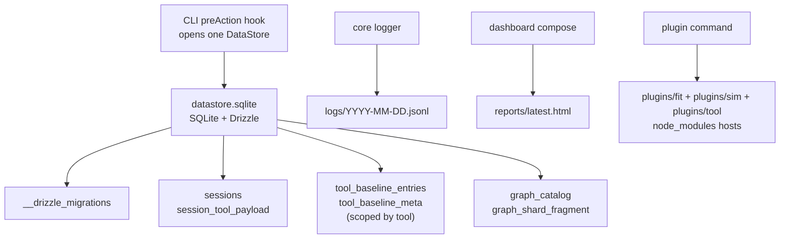

# Session and persistence

A run produces three kinds of on-disk artifacts: the SQLite database, structured log files, and HTML reports. All three live under one directory — `<project>/opensip-cli/.runtime/` — which is gitignored and rebuildable.

> **What you'll understand after this:**
> - The on-disk layout and what's stored where.
> - Tool-produced data (sessions, catalog, baselines) → SQLite via `DataStore`.
> - Logs and reports stay as files; rendering channels for external consumers.
> - The schema-migration model and the upgrade / downgrade contract.

---

## The runtime dir layout

```
<project>/opensip-cli/.runtime/
├── datastore.sqlite                            ← single SQLite store for tool-produced data
├── datastore.sqlite-wal                        ← WAL journal (created when writes are in flight)
├── datastore.sqlite-shm                        ← shared-memory page (companion to WAL)
├── reports/latest.html                         ← rewritten by every dashboard generation
├── logs/<YYYY-MM-DD>.jsonl                     ← one log file per local day, shared across runs
└── plugins/                                    ← npm-installed project plugins
    ├── fit/node_modules/
    ├── sim/node_modules/
    └── tool/node_modules/
```

Source of truth: [`packages/core/src/lib/paths.ts`](https://github.com/opensip-ai/opensip-cli/blob/v0.1.4/packages/core/src/lib/paths.ts). Every consumer reads paths through `resolveProjectPaths(cwd)`. The directory is created lazily by whichever consumer needs a subpath first; `mkdirSync(..., { recursive: true })` is the standard idiom.

The WAL/SHM sidecar files are SQLite implementation details (Write-Ahead Log mode, enabled at open time so concurrent reads — e.g. from `graph --workspace` child processes — don't block writes). They may be empty or absent after a clean shutdown depending on SQLite's WAL checkpoint timing; both states are normal.

---

## The DataStore

[`packages/datastore`](https://github.com/opensip-ai/opensip-cli/blob/v0.1.4/packages/datastore) hosts the persistence kernel: a `DataStore` interface, a SQLite-backed implementation, an in-memory implementation for tests, and the workspace-wide migration store under `migrations/`. The CLI bootstrap opens one `DataStore` per invocation in the `preAction` hook ([`packages/cli/src/index.ts`](https://github.com/opensip-ai/opensip-cli/blob/v0.1.4/packages/cli/src/index.ts)) and closes it on `process.exit`. Every tool's command receives the handle via `ToolCliContext.datastore`.

Schemas are owned by the package that produces the data — datastore is paradigm-agnostic infrastructure — **with one deliberate exception**: baseline persistence is a host-owned plane (ADR-0036). A tool that wants tool-specific tables (like graph's catalog cache) adds a schema module under its `src/persistence/schema.ts` and registers it in [`packages/datastore/drizzle.config.ts`](https://github.com/opensip-ai/opensip-cli/blob/v0.1.4/packages/datastore/drizzle.config.ts); a tool that wants the **gate** (`--gate-save`/`--gate-compare`/export) adds *no schema at all* — it inherits the generic `tool_baseline_entries` / `tool_baseline_meta` pair (scoped by a `tool` column, [`packages/datastore/src/schema/baseline.ts`](https://github.com/opensip-ai/opensip-cli/blob/v0.1.4/packages/datastore/src/schema/baseline.ts)) by stamping fingerprints on its signals. The schema registrations today:

| Owner | Schema file | Tables |
|---|---|---|
| `@opensip-cli/session-store` | `src/schema/sessions.ts` | `sessions`, `session_tool_payload` |
| `@opensip-cli/graph` | `src/persistence/schema.ts` | `graph_catalog`, `graph_shard_fragment` |
| `@opensip-cli/datastore` (host) | `src/schema/baseline.ts` | `tool_baseline_entries`, `tool_baseline_meta` (all tools' gate baselines) |

`__drizzle_migrations` is a fourth, internal table — Drizzle uses it to record which migrations have been applied. (The historical per-tool baseline tables — `fit_baseline`, `graph_baseline_signals`, `graph_baseline_meta` — were dropped by migration when ADR-0036 landed; baselines are drop-and-recapture, so a re-run of `--gate-save` rebuilds them in the generic pair.)



SQLite + Drizzle were chosen because the runtime store is local, project-scoped, transactional, and small enough to rebuild if a user needs to delete it. A remote database, JSON-as-backend, or a broader persistence abstraction would add operational weight without improving the CLI's local-first behavior.

---

## Sessions

A session is one record per `fit`, `sim`, or `graph` run. The persistence layer holds **zero tool-specific vocabulary** (audit 2026-05-29, session split): the `sessions` table carries only the columns every tool shares, and per-session detail lives in a separate `session_tool_payload` row as an **opaque JSON blob** whose shape is owned and validated by the writing tool. The `StoredSession` interface in [`packages/contracts/src/session-types.ts`](https://github.com/opensip-ai/opensip-cli/blob/v0.1.4/packages/contracts/src/session-types.ts) is what `SessionRepo` round-trips:

```ts
interface StoredSession {
  readonly id: string;
  readonly tool: 'fit' | 'sim' | 'graph';   // ToolShortId
  readonly startedAt: string;                // host-stamped: wall-clock run start
  readonly completedAt: string;              // host-stamped: when the tool returned to the host
  readonly cwd: string;
  readonly recipe?: string;
  readonly score: number;
  readonly passed: boolean;
  readonly durationMs: number;               // host-stamped: canonical monotonic duration (not TTY-busy)
  readonly hostMetrics?: StoredSessionHostMetrics;  // host-side overhead, hydrated from a sibling record
  readonly payload?: unknown;                // tool-owned opaque detail; contracts never inspects it
}
```

The lifecycle timing (`startedAt` / `completedAt` / `durationMs`) and `hostMetrics` are **host-owned** — the writing tool supplies only `tool` / `cwd` / `recipe?` / `score` / `passed` / `payload?` (see [Host-owned run timing](#host-owned-run-timing-adr-0051--host-owned-run-timing-plan) below).

The old per-check / per-finding columns (`session_checks`, `session_findings`) are gone — that detail now rides inside `payload` (checks, findings, summaries, etc. for `fit`; whatever shape each tool defines). `contracts` treats `payload` as `unknown`; the dashboard, as presentation owner, reads and renders it — the same producer/consumer split used for `GraphCatalog`.

Tool payloads follow a documented inner `__version` convention for evolution (see `StoredSession` JSDoc in contracts, the per-tool `build*SessionPayload` implementations, and `ToolStateRepo` JSDoc). Legacy rows are projected with `fidelity: 'projection'`. See the payload-schema-evolution plan and ADR-0050.

The session is written via [`SessionRepo.save()`](https://github.com/opensip-ai/opensip-cli/blob/v0.1.4/packages/session-store/src/session-repo.ts) inside a single transaction (the `sessions` row plus, when `payload` is present, one `session_tool_payload` row), so even a run that crashes mid-render leaves a complete or no record — never a partial one.

### The `sessions` command

```bash
opensip sessions list                       # SELECT * FROM sessions ORDER BY timestamp DESC
opensip sessions list --json --summary-only # lean listing for agents (omits heavy payloads)
opensip sessions show <id>                  # replay a stored session (or `latest --tool <fit|graph|sim>`)
opensip sessions show latest --tool fit --json --filter errors-only --filter top:20
opensip sessions purge                      # DELETE FROM sessions (prompts for confirm)
opensip sessions purge --older-than 7       # DELETE FROM sessions WHERE timestamp < cutoff
opensip sessions purge -y                   # skip the confirmation prompt
```

`purge` is **row-level data deletion**, not file removal. The FK cascade from `sessions` → `session_tool_payload` (`onDelete: 'cascade'`) ensures that purging a session drops its opaque payload row in one shot.

The dashboard reads the same store to populate its run-history view. For programmatic discovery of these surfaces (especially the new agent ergonomics around filtering and raw output), see `agent-catalog` in the [CLI commands reference](/docs/opensip-cli/70-reference/01-cli-commands/).

**Session replay.** `sessions show` (and the per-run `--show <session>`
shorthand on `fit`/`graph`/`sim`) reconstructs a past run's output from its
stored payload. The opaque payload is decoded back into its structural shape by
the shared `decodeSessionPayload` in [`@opensip-cli/session-store`](https://github.com/opensip-ai/opensip-cli/blob/v0.1.4/packages/session-store/src/session-payload-decode.ts)
— persistence owns the structural decode but still holds **zero tool
vocabulary**. Each tool then projects that structure into a `SignalEnvelope` via
its `sessionReplay` contribution (`fit`/`graph`/`sim`), tagging the result
`fidelity: 'projection'` (rebuilt from persisted findings, not re-executed).
Failures (`not-found`, `wrong-tool`, `ambiguous-latest`, `decode-error`) surface
as a structured `CommandOutcome` error with exit 2.

The `--filter` (errors-only / warnings-only / top:<n>) and `--raw` options on `show`, plus `--summary-only` on `list`, provide agent-friendly ergonomics for historical result inspection without changing any human-readable output.

---

## The graph catalog

`@opensip-cli/graph` builds a call-graph catalog (functions, occurrences, calls) and persists it via [`CatalogRepo`](https://github.com/opensip-ai/opensip-cli/blob/v0.1.4/packages/graph/engine/src/persistence/catalog-repo.ts). The store keeps the whole catalog as a single SQLite row; metadata fields (language, cache key, files fingerprint) are lifted into typed columns so the orchestrator can fingerprint-mismatch without parsing the payload.

### The derived `features` surface (ADR-0006)

The persisted catalog document carries an optional **`features`** layer — derived columns the engine computes from the raw catalog: per-function `bodyLines` / `blast` (direct + transitive blast radius) / reachability flags, per-package coupling degrees, SCC membership, and directed package-coupling edges. The contract shape is [`GraphFeatures`](https://github.com/opensip-ai/opensip-cli/blob/v0.1.4/packages/contracts/src/graph-catalog.ts) (structurally mirrored from the engine's `PersistedFeatures` so the decoupled dashboard reads features without importing `@opensip-cli/graph`).

## Host-owned run timing (ADR-0051 / host-owned-run-timing plan)

`StoredSession.startedAt`, `completedAt`, and `durationMs` are produced exclusively by the host from a single `RunTimer` (a.k.a. `RunLifecycle`). The host run plane (`packages/cli/src/bootstrap/run-plane.ts`) creates the lifecycle inside the command action — after `RunScope` entry, before any tool handler or `renderLive` — and freezes it (`complete()`, idempotent) once the tool returns. Tools read the timer only for a **display clock** via `ToolCliContext.runSession.timing` (also passed as the optional second `LiveViewContext` arg to live renderers registered with `cli.registerLiveView`). There is **no** generic-session writer on the context.

**The contribution model.** A tool RECORDS a run by RETURNING a `ToolRunCompletion` from its command handler or live renderer — `{ result?, envelope?, session?, dashboard? }`. Its `session` is a `ToolSessionContribution` `{ tool, cwd, recipe?, score, passed, payload? }` (no timing). The host run plane then stamps the frozen `startedAt`/`completedAt`/`durationMs`, generates the id via `generatePrefixedId(tool)`, writes via `SessionRepo`, records `persistMs` on the sibling host-metrics record, and (for a live run) records `ttyBusyMs`. Persistence is best-effort: no datastore ⇒ no row, never throws, never affects the result or exit code.

### Clock taxonomy

| Clock | Owner | Where it lives |
| --- | --- | --- |
| `startedAt` / `completedAt` / `durationMs` | **host** RunTimer | `StoredSession` generic columns |
| `persistMs` / `ttyBusyMs` / `renderMs` / `egressMs` / `totalCommandMs` | **host** run plane | sibling `StoredSessionHostMetrics`, hydrated onto `StoredSession.hostMetrics` |
| per-unit / per-stage / per-recipe / profile timers | **tool** | the tool's opaque `payload` (or `collectReportData`) |
| SignalEnvelope `createdAt` / verdict duration | **tool** | the tool's `SignalEnvelope` artifact |

**Rules enforced by the `architecture-session-timing-not-host-owned` fitness check (path-gated to the first-party tool packages) + hygiene:**
- First-party tool code must not reference the generic-session persistence surface — `SessionRepo`, any `persist*Session` helper (removed in Phase 3), or a `runSession.record(...)` writer (removed in Phase 6). There is no tool-side generic-session writer.
- Internal per-unit/stage/recipe/profile timers and the tool's own SignalEnvelope timing are explicitly allowed and encouraged for diagnostics — they stay in the tool's payload / envelope / `collectReportData` and never feed the generic columns. (Read helpers like `resolveSession` / `decodeSessionPayload` for replay are likewise fine.)

The live and static render paths (via `RunTimingProvider` in cli-ui + `RunSummary` reading the provider when `durationMs` is omitted, and static `result-to-view` falling back to a host snapshot) ensure the "Duration X" line the user sees is the same value that ends up in `sessions list`, `sessions show`, and the HTML report.

See [ADR-0051](https://github.com/opensip-ai/opensip-cli/blob/v0.1.4/docs/decisions/ADR-0051-host-owned-run-lifecycle-timing.md) and the cross-cutting contracts in the host-owned-run-timing plan for the full seam, logging, and hardening details.

The persistence policy is **materialize only when forced** (ADR-0006): features are a *plain view* recomputed on demand for in-engine rules, and **materialized into the catalog JSON only for the columns the decoupled dashboard renders** (blast, SCC, package coupling). The `features` field is therefore present only on catalogs produced by a dashboard-bound run; the dashboard falls back to a no-data state when it's absent. Everything else (callers/callees indexes) is recomputed cheaply on every load and never stored.

The `--workspace` runner spawns one child process per workspace unit (per adapter `discoverWorkspaceUnits`). Each child opens its own `DataStore` against the shared `datastore.sqlite` file. WAL mode permits concurrent readers + one writer, so the parallelism is safe but serialized at the catalog write boundary — per-unit incremental writes are deferred to a follow-up `graph-catalog-perf` plan.

The `--no-cache` flag forces a cache miss; the existing fingerprint-based invalidation path runs even when `datastore.sqlite` is present and current.

---

## The gate baselines (host-owned plane, ADR-0036)

All tools' gate baselines live in **one generic table pair** in the SQLite store, scoped by a `tool` column:

- **`tool_baseline_entries`** — one row per finding: `(tool, fingerprint)` composite key plus the full `Signal` JSON payload (the payload feeds the `resolved` diff bucket and the SARIF re-render). `fit --gate-save` writes rows with `tool = 'fitness'`; `graph --gate-save` with `tool = 'graph'`. Save is a per-tool delete-all + bulk-insert (atomic replace).
- **`tool_baseline_meta`** — a per-tool existence marker + capture timestamp, so an empty-but-saved baseline (a clean codebase) reports `exists() === true`.

The capture (`--gate-save`), ratchet (`--gate-compare`), and export (SARIF + JSON fingerprints) machinery are host seams (`saveBaseline`/`compareBaseline`/`exportBaselineSarif`/`exportBaselineFingerprints` on `ToolCliContext`) over the generic [`BaselineRepo`](https://github.com/opensip-ai/opensip-cli/blob/v0.1.4/packages/datastore/src/baseline-repo.ts) plus the pure `diffBaseline` in `@opensip-cli/output`. A tool inherits the whole gate by stamping fingerprints on its signals — it authors at most a `Tool.fingerprintStrategy` (fitness: `sha256(filePath\nruleId\nmessage)`, line-shift tolerant; graph: `ruleId|filePath|line|column`, message-excluded) and **no schema, no repo, no diff code**.

### Baselines live in SQLite

Each tool has exactly one baseline per project in the SQLite database.
`--gate-save` replaces that tool's baseline rows; `--gate-compare` compares the
current run against the saved rows. SARIF remains an export format, not the
baseline store.

---

## Logs

Structured JSON Lines, one event per line. Written to two destinations simultaneously:

1. **stderr** — for live observation (`opensip fit 2>&1 | jq`).
2. **`<project>/opensip-cli/.runtime/logs/<YYYY-MM-DD>.jsonl`** — one file per local day; every run on the same day appends to the same file. Filter with `jq` on the `runId` field to isolate a specific run.

The logger is in [`packages/core/src/lib/logger.ts`](https://github.com/opensip-ai/opensip-cli/blob/v0.1.4/packages/core/src/lib/logger.ts). Every log entry carries:

- `evt` — the event name (`cli.fit.run.start`, `session.save.complete`, etc.).
- `module` — the module that emitted it (`cli:fit`, `contracts:session-repo`, …).
- `runId` — the per-run correlation id.
- Plus event-specific fields.

Persistence call sites emit structured events with stable `evt:` names: `session.save.complete` / `.list.complete` / `.purge.complete`, `graph.baseline.save.complete` / `.load.complete` / `.load.miss`, `graph.catalog.read.hit` / `.read.miss` / `.write.complete`, `fit.baseline.save.complete` / `.load.complete` / `.load.miss`. Observability did not regress with the storage swap.

The log file persists until manually deleted. There's no rotation; that's the user's job. `sessions purge` deletes session rows but leaves logs alone, by design.

---

## Reports

The HTML report writes a single self-contained file at `<project>/opensip-cli/.runtime/reports/latest.html`. Each generation overwrites the previous file — the report is "always show the most recent state", not a per-run archive.

Composition is owned by the **CLI** ([`packages/cli/src/report-compose.ts`](https://github.com/opensip-ai/opensip-cli/blob/v0.1.4/packages/cli/src/report-compose.ts)), the cross-tool composition root. It reads sessions via `SessionRepo.list({ limit: 20 })`, then walks every registered tool's optional `collectReportData(scope)` seam and merges the keyed contributions into one `DashboardInput` — graph returns its `graphCatalog` (via `CatalogRepo.loadCatalogContract()`), fitness returns its catalogs, neither reaching into the other (this is what the `fitness-no-graph` / `graph-no-fitness` layer rules enforce). The merged input is handed to `generateDashboardHtml` ([`@opensip-cli/dashboard`](https://github.com/opensip-ai/opensip-cli/blob/v0.1.4/packages/dashboard/src/generator.ts)), which assembles the inlined HTML (JS via `<script type="module">`, CSS via `<style>`, session/catalog data via `<script type="application/json">`). The output is one self-contained file you can email — no CDN, no asset bundle, no server.

The report auto-open hook fires after a run if (a) `--open` was requested or auto-open is configured, (b) output isn't `--json`, and (c) stdout is a TTY.

---

## Upgrade behavior

`DataStoreFactory.open()` applies any pending Drizzle migrations on every CLI invocation. Migrations are content-hashed and idempotent. Users see no extra step; first run of a new opensip-cli version brings the schema up to date in milliseconds. After a successful migrate it stamps the SQLite header (`PRAGMA user_version`) with the number of migrations this build ships.

**Downgrades across schema changes are unsupported** — Drizzle has no down-migration concept, and an older CLI cannot detect a newer schema on its own (its migrations are a prefix of what was applied, so `migrate()` no-ops and later queries hit missing columns). The version stamp closes that gap: on open, a CLI whose supported version is behind the on-disk stamp fails fast with `DataStoreVersionError`, whose message offers two recoveries — upgrade the CLI (`curl -fsSL https://opensip.ai/cli/install.sh | bash`), or delete `<project>/opensip-cli/.runtime/datastore.sqlite` to continue on the older CLI (cache rebuilds on next run; session history is lost). The forward direction (newer CLI, older or pre-guard `user_version 0` DB) auto-migrates and re-stamps with no user action.

If opening or migrating fails for other reasons (corrupted DB header, unwritable directory), the CLI surfaces a `DataStoreMigrationError` with the same delete-to-recover hint.

---

## Lifecycle commands and what they touch

A reference for "I want to free disk / I'm debugging."

| Command | Touches |
|---|---|
| `opensip sessions list` | `SELECT FROM sessions` |
| `opensip sessions purge --older-than N` | `DELETE FROM sessions WHERE timestamp < cutoff` (FK cascades to the tool-payload row) |
| `opensip fit --no-cache` / `graph --no-cache` | Forces cache miss; rebuilds full catalog/results, ignores any cached row |
| `opensip uninstall --project [path]` | Removes `<path>/opensip-cli/` recursively. **`datastore.sqlite` and its `-wal` / `-shm` sidecars are caught transitively.** On Windows, ensure no opensip-cli CLI process is active when running this — open file handles can block WAL/SHM removal. |
| `opensip uninstall` (no flag) | Removes `~/.opensip-cli/`. No DB there; user-global state is a single config file. |
| Manual `rm <path>/opensip-cli/.runtime/datastore.sqlite*` | Wipes the project DB. Caches rebuild; session history is lost. |

The whole `<project>/opensip-cli/` directory is also safe to delete; `opensip init` will scaffold it fresh. You lose your custom checks and recipes if you didn't commit them.

---

## What's next

- **[`../10-concepts/05-architecture-gate.md`](/docs/opensip-cli/10-concepts/05-architecture-gate/)** — the gate's full behavior and the baseline format.
- **[`../70-reference/06-dashboard.md`](/docs/opensip-cli/70-reference/06-dashboard/)** — the HTML report's structure and the `report` command.
- **[`../70-reference/03-configuration.md`](/docs/opensip-cli/70-reference/03-configuration/)** — `opensip-cli.config.yml` schema (the one bit of project state that's not in `.runtime/`).
- **[`../80-implementation/05-layer-policy.md`](/docs/opensip-cli/80-implementation/05-layer-policy/)** — where datastore sits in the workspace layering.
