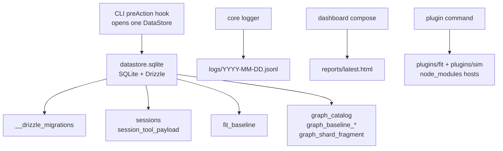

# Session and persistence

A run produces three kinds of on-disk artifacts: the SQLite database, structured log files, and HTML dashboard reports. All three live under one directory — `<project>/opensip-tools/.runtime/` — which is gitignored and rebuildable.

> **What you'll understand after this:**
> - The on-disk layout and what's stored where.
> - Tool-produced data (sessions, catalog, baselines) → SQLite via `DataStore`.
> - Logs and reports stay as files; rendering channels for external consumers.
> - The schema-migration model and the upgrade / downgrade contract.

---

## The runtime dir layout

```
<project>/opensip-tools/.runtime/
├── datastore.sqlite                            ← single SQLite store for tool-produced data
├── datastore.sqlite-wal                        ← WAL journal (created when writes are in flight)
├── datastore.sqlite-shm                        ← shared-memory page (companion to WAL)
├── reports/latest.html                         ← rewritten by every dashboard generation
├── logs/<YYYY-MM-DD>.jsonl                     ← one log file per local day, shared across runs
└── plugins/                                    ← npm-installed project plugins
    ├── fit/node_modules/
    └── sim/node_modules/
```

Source of truth: [`packages/core/src/lib/paths.ts`](https://github.com/opensip-ai/opensip-tools/blob/v2.13.0/packages/core/src/lib/paths.ts). Every consumer reads paths through `resolveProjectPaths(cwd)`. The directory is created lazily by whichever consumer needs a subpath first; `mkdirSync(..., { recursive: true })` is the standard idiom.

The WAL/SHM sidecar files are SQLite implementation details (Write-Ahead Log mode, enabled at open time so concurrent reads — e.g. from `graph --workspace` child processes — don't block writes). They may be empty or absent after a clean shutdown depending on SQLite's WAL checkpoint timing; both states are normal.

---

## The DataStore

[`packages/datastore`](https://github.com/opensip-ai/opensip-tools/blob/v2.13.0/packages/datastore) hosts the persistence kernel: a `DataStore` interface, a SQLite-backed implementation, an in-memory implementation for tests, and the workspace-wide migration store under `migrations/`. The CLI bootstrap opens one `DataStore` per invocation in the `preAction` hook ([`packages/cli/src/index.ts`](https://github.com/opensip-ai/opensip-tools/blob/v2.13.0/packages/cli/src/index.ts)) and closes it on `process.exit`. Every tool's command receives the handle via `ToolCliContext.datastore`.

Schemas are owned by the package that produces the data — datastore is paradigm-agnostic infrastructure. Adding a new tool means adding a new schema module under that package's `src/persistence/schema.ts` and registering it in [`packages/datastore/drizzle.config.ts`](https://github.com/opensip-ai/opensip-tools/blob/v2.13.0/packages/datastore/drizzle.config.ts). Three packages register schemas today:

| Owner | Schema file | Tables |
|---|---|---|
| `@opensip-tools/session-store` | `src/schema/sessions.ts` | `sessions`, `session_tool_payload` |
| `@opensip-tools/graph` | `src/persistence/schema.ts` | `graph_baseline_signals`, `graph_baseline_meta`, `graph_catalog`, `graph_shard_fragment` |
| `@opensip-tools/fitness` | `src/persistence/schema.ts` | `fit_baseline` |

`__drizzle_migrations` is a fourth, internal table — Drizzle uses it to record which migrations have been applied.



SQLite + Drizzle were chosen because the runtime store is local, project-scoped, transactional, and small enough to rebuild if a user needs to delete it. A remote database, JSON-as-backend, or a broader persistence abstraction would add operational weight without improving the CLI's local-first behavior.

---

## Sessions

A session is one record per `fit`, `sim`, or `graph` run. The persistence layer holds **zero tool-specific vocabulary** (audit 2026-05-29, session split): the `sessions` table carries only the columns every tool shares, and per-session detail lives in a separate `session_tool_payload` row as an **opaque JSON blob** whose shape is owned and validated by the writing tool. The `StoredSession` interface in [`packages/contracts/src/session-types.ts`](https://github.com/opensip-ai/opensip-tools/blob/v2.13.0/packages/contracts/src/session-types.ts) is what `SessionRepo` round-trips:

```ts
interface StoredSession {
  readonly id: string;
  readonly tool: 'fit' | 'sim' | 'graph';   // ToolShortId
  readonly timestamp: string;
  readonly cwd: string;
  readonly recipe?: string;
  readonly score: number;
  readonly passed: boolean;
  readonly durationMs: number;
  readonly payload?: unknown;                // tool-owned opaque detail; contracts never inspects it
}
```

The old per-check / per-finding columns (`session_checks`, `session_findings`) are gone — that detail now rides inside `payload` (checks, findings, summaries, etc. for `fit`; whatever shape each tool defines). `contracts` treats `payload` as `unknown`; the dashboard, as presentation owner, reads and renders it — the same producer/consumer split used for `GraphCatalog`.

The session is written via [`SessionRepo.save()`](https://github.com/opensip-ai/opensip-tools/blob/v2.13.0/packages/session-store/src/session-repo.ts) inside a single transaction (the `sessions` row plus, when `payload` is present, one `session_tool_payload` row), so even a run that crashes mid-render leaves a complete or no record — never a partial one.

### The `sessions` command

```bash
opensip-tools sessions list                       # SELECT * FROM sessions ORDER BY timestamp DESC
opensip-tools sessions show <id>                  # replay a stored session (or `latest --tool <fit|graph|sim>`)
opensip-tools sessions purge                      # DELETE FROM sessions (prompts for confirm)
opensip-tools sessions purge --older-than 7       # DELETE FROM sessions WHERE timestamp < cutoff
opensip-tools sessions purge -y                   # skip the confirmation prompt
```

`purge` is **row-level data deletion**, not file removal. The FK cascade from `sessions` → `session_tool_payload` (`onDelete: 'cascade'`) ensures that purging a session drops its opaque payload row in one shot.

The dashboard reads the same store to populate its run-history view.

**Session replay (2.12.0).** `sessions show` (and the per-run `--show <session>` shorthand on `fit`/`graph`/`sim`) reconstructs a past run's output from its stored payload. The opaque payload is decoded back into its structural shape by the shared `decodeSessionPayload` in [`@opensip-tools/session-store`](https://github.com/opensip-ai/opensip-tools/blob/v2.12.0/packages/session-store/src/session-payload-decode.ts) — persistence owns the structural decode but still holds **zero tool vocabulary**. Each tool then projects that structure into a `SignalEnvelope` via its `sessionReplay` contribution (`fit`/`graph`/`sim`), tagging the result `fidelity: 'projection'` (rebuilt from persisted findings, not re-executed). Failures (`not-found`, `wrong-tool`, `ambiguous-latest`, `decode-error`) surface as a structured `CommandOutcome` error with exit 2.

---

## The graph catalog

`@opensip-tools/graph` builds a call-graph catalog (functions, occurrences, calls) and persists it via [`CatalogRepo`](https://github.com/opensip-ai/opensip-tools/blob/v2.13.0/packages/graph/engine/src/persistence/catalog-repo.ts). v2 stores the whole catalog as a single SQLite row; metadata fields (language, cache key, files fingerprint) are lifted into typed columns so the orchestrator can fingerprint-mismatch without parsing the payload.

### The derived `features` surface (ADR-0006)

The persisted catalog document carries an optional **`features`** layer — derived columns the engine computes from the raw catalog: per-function `bodyLines` / `blast` (direct + transitive blast radius) / reachability flags, per-package coupling degrees, SCC membership, and directed package-coupling edges. The contract shape is [`GraphFeatures`](https://github.com/opensip-ai/opensip-tools/blob/v2.13.0/packages/contracts/src/graph-catalog.ts) (structurally mirrored from the engine's `PersistedFeatures` so the decoupled dashboard reads features without importing `@opensip-tools/graph`).

The persistence policy is **materialize only when forced** (ADR-0006): features are a *plain view* recomputed on demand for in-engine rules, and **materialized into the catalog JSON only for the columns the decoupled dashboard renders** (blast, SCC, package coupling). The `features` field is therefore present only on catalogs produced by a dashboard-bound run; the dashboard falls back to a no-data state when it's absent. Everything else (callers/callees indexes) is recomputed cheaply on every load and never stored.

The `--workspace` runner spawns one child process per workspace unit (per adapter `discoverWorkspaceUnits`). Each child opens its own `DataStore` against the shared `datastore.sqlite` file. WAL mode permits concurrent readers + one writer, so the parallelism is safe but serialized at the catalog write boundary — per-unit incremental writes are deferred to a follow-up `graph-catalog-perf` plan.

The `--no-cache` flag forces a cache miss; the existing fingerprint-based invalidation path runs even when `datastore.sqlite` is present and current.

---

## The gate baselines

Two baselines live in the SQLite store:

- **Fitness baseline** (`fit_baseline`) — the SARIF document produced by `opensip-tools fit --gate-save`. Single-row table; `--gate-compare` reads it and diffs against the current SARIF by `(filePath, ruleId, message)` hash.
- **Graph baseline** (`graph_baseline_signals` + `graph_baseline_meta`) — the fingerprint set produced by `opensip-tools graph --gate-save`. The `meta` row marks "a baseline exists" so an empty-but-saved baseline (a clean codebase) reports `exists() === true`.

### v1 → v2: the `--baseline <path>` flag is gone

v1 wrote baselines as JSON/SARIF files (`baseline.sarif`, `cache/graph/baseline.json`) and let users override the path with `--baseline`. v2 stores exactly one baseline per project, in the SQLite database. **Drop `--baseline path/to/file.sarif` from CI invocations**; the flag has no equivalent. Teams that committed `baseline.sarif` to git for cross-CI-run gate comparisons should re-run `--gate-save` once the new code lands. See the v2.0.0 entry in [`CHANGELOG.md`](https://github.com/opensip-ai/opensip-tools/blob/v2.13.0/CHANGELOG.md) for the full break.

---

## Logs

Structured JSON Lines, one event per line. Written to two destinations simultaneously:

1. **stderr** — for live observation (`opensip-tools fit 2>&1 | jq`).
2. **`<project>/opensip-tools/.runtime/logs/<YYYY-MM-DD>.jsonl`** — one file per local day; every run on the same day appends to the same file. Filter with `jq` on the `runId` field to isolate a specific run.

The logger is in [`packages/core/src/lib/logger.ts`](https://github.com/opensip-ai/opensip-tools/blob/v2.13.0/packages/core/src/lib/logger.ts). Every log entry carries:

- `evt` — the event name (`cli.fit.run.start`, `session.save.complete`, etc.).
- `module` — the module that emitted it (`cli:fit`, `contracts:session-repo`, …).
- `runId` — the per-run correlation id.
- Plus event-specific fields.

Persistence call sites emit structured events with stable `evt:` names: `session.save.complete` / `.list.complete` / `.purge.complete`, `graph.baseline.save.complete` / `.load.complete` / `.load.miss`, `graph.catalog.read.hit` / `.read.miss` / `.write.complete`, `fit.baseline.save.complete` / `.load.complete` / `.load.miss`. Observability did not regress with the storage swap.

The log file persists until manually deleted. There's no rotation; that's the user's job. `sessions purge` deletes session rows but leaves logs alone, by design.

---

## Reports

The HTML dashboard writes a single self-contained file at `<project>/opensip-tools/.runtime/reports/latest.html`. Each generation overwrites the previous file — the dashboard is "always show the most recent state", not a per-run archive.

Composition is owned by the **CLI** ([`packages/cli/src/dashboard-compose.ts`](https://github.com/opensip-ai/opensip-tools/blob/v2.13.0/packages/cli/src/dashboard-compose.ts)), the cross-tool composition root. It reads sessions via `SessionRepo.list({ limit: 20 })`, then walks every registered tool's optional `collectDashboardData(scope)` seam and merges the keyed contributions into one `DashboardInput` — graph returns its `graphCatalog` (via `CatalogRepo.loadCatalogContract()`), fitness returns its catalogs, neither reaching into the other (this is what the `fitness-no-graph` / `graph-no-fitness` layer rules enforce). The merged input is handed to `generateDashboardHtml` ([`@opensip-tools/dashboard`](https://github.com/opensip-ai/opensip-tools/blob/v2.13.0/packages/dashboard/src/generator.ts)), which assembles the inlined HTML (JS via `<script type="module">`, CSS via `<style>`, session/catalog data via `<script type="application/json">`). The output is one self-contained file you can email — no CDN, no asset bundle, no server.

The dashboard auto-open hook fires after a run if (a) `--open` was requested or auto-open is configured, (b) output isn't `--json`, and (c) stdout is a TTY.

---

## Upgrade behavior

`DataStoreFactory.open()` applies any pending Drizzle migrations on every CLI invocation. Migrations are content-hashed and idempotent. Users see no extra step; first run of a new opensip-tools version brings the schema up to date in milliseconds.

If migration fails (corrupted DB, downgrade across schema changes), the CLI surfaces a `DataStoreMigrationError` with a recovery hint pointing at deleting `<project>/opensip-tools/.runtime/datastore.sqlite`. Cache rebuilds on next run; session history is lost. **Downgrades across schema changes are unsupported** — Drizzle has no down-migration concept.

---

## Lifecycle commands and what they touch

A reference for "I want to free disk / I'm debugging."

| Command | Touches |
|---|---|
| `opensip-tools sessions list` | `SELECT FROM sessions` |
| `opensip-tools sessions purge --older-than N` | `DELETE FROM sessions WHERE timestamp < cutoff` (FK cascades to the tool-payload row) |
| `opensip-tools fit --no-cache` / `graph --no-cache` | Forces cache miss; rebuilds full catalog/results, ignores any cached row |
| `opensip-tools uninstall --project [path]` | Removes `<path>/opensip-tools/` recursively. **`datastore.sqlite` and its `-wal` / `-shm` sidecars are caught transitively.** On Windows, ensure no opensip-tools CLI process is active when running this — open file handles can block WAL/SHM removal. |
| `opensip-tools uninstall` (no flag) | Removes `~/.opensip-tools/`. No DB there; user-global state is a single config file. |
| Manual `rm <path>/opensip-tools/.runtime/datastore.sqlite*` | Wipes the project DB. Caches rebuild; session history is lost. |

The whole `<project>/opensip-tools/` directory is also safe to delete; `opensip-tools init` will scaffold it fresh. You lose your custom checks and recipes if you didn't commit them.

---

## What's next

- **[`../10-concepts/05-architecture-gate.md`](/docs/opensip-tools/10-concepts/05-architecture-gate/)** — the gate's full behavior and the baseline format.
- **[`../70-reference/06-dashboard.md`](/docs/opensip-tools/70-reference/06-dashboard/)** — the HTML report's structure and the `dashboard` command.
- **[`../70-reference/03-configuration.md`](/docs/opensip-tools/70-reference/03-configuration/)** — `opensip-tools.config.yml` schema (the one bit of project state that's not in `.runtime/`).
- **[`../80-implementation/05-layer-policy.md`](/docs/opensip-tools/80-implementation/05-layer-policy/)** — where datastore sits in the workspace layering.
